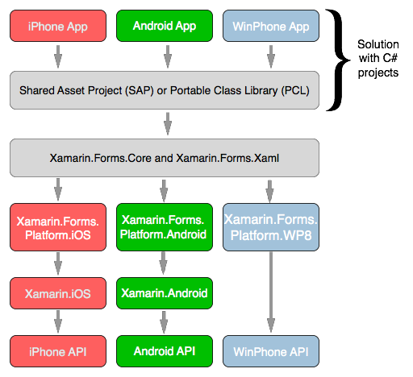
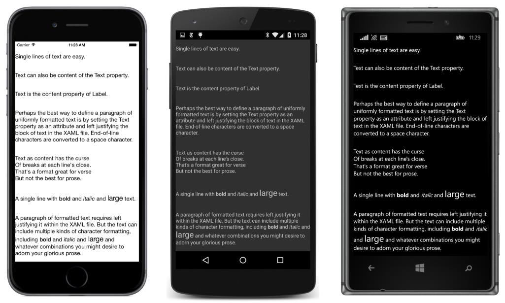

## A opção Xamarin.Forms {#a-op-o-xamarin-forms}

No caso geral, uma aplicação Xamarin.Forms é composta de três projetos separados para as três plataformas móveis, com um quarto projeto que contém o código-muito comum muito parecido com o diagrama que apareceu na seção anterior. No entanto, os três projectos de plataformas em um aplicativo Xamarin.Forms são tipicamente muito pequenos, muitas vezes consistindo de apenas stubs com um pouco de código de inicialização do clichê. O Projeto de propriedade compartilhada, ou no portátil projeto Class Library, contém a maior parte do aplicativo, incluindo o código da interface pelo usuário:

As bibliotecas Xamarin.Forms.Core e Xamarin.Forms.Xaml implementar a API Xamarin.Forms. Dependendo da plataforma, Xamarin.Forms.Core seguida, faz uso de uma das bibliotecas Xamarin.Forms.Platform. Essas bibliotecas são na maior parte uma coleção de classes chamados representantes que transformam os objetos de interface do usuário Xama- rin.Forms na interface do usuário específico da plataforma.

O restante do diagrama é o mesmo que o mostrado anteriormente.

Por exemplo, suponha que você precisa do objeto de interface do usuário discutido anteriormente que permite ao usuário para alternar um valor booleano. Ao programar para Xamarin.Forms, isso é chamado de Switch, e uma classe chamada Mudar é implementada na biblioteca Xamarin.Forms.Core. Na os representantes individuais para as três plataformas, este switch é mapeado para um UISwitch no iPhone, um interruptor no Android, e um telefone ToggleSwitchButton no Windows.

Xamarin.Forms.Core também contém uma classe chamada Slider para a exibição de uma barra horizontal que o usuário manipula para escolher um valor numérico. Na os representantes nas bibliotecas específicas da plataforma, este é mapeado para um UISlider no iPhone, a SeekBar no Android, e um telefone deslizante no Windows.

Isto significa que quando você escreve um programa Xamarin.Forms que tem um interruptor ou um Slider, o que está realmente exibido é o objeto correspondente implementado em cada plataforma.

Aqui está um pequeno programa Xamarin.Forms contendo uma etiqueta dizendo &quot;Olá, Xamarin.Forms!&quot;, Um botão que diz &quot;Clique-me!&quot;, Um interruptor e um Slider. O programa está sendo executado em (a partir da esquerda para a direita) o iPhone, Android e Windows Phone:

Você verá os screenshots triplos como este ao longo deste livro. Elas estão sempre na mesma ordem-iPhone, Android e Windows Phone e neles estão correndo sempre o mesmo programa.

Como você pode ver, o Button, switch e Slider todos têm aparências diferentes nas três telefones porque todos eles são renderizados com o objeto específico para cada plataforma.

O que é ainda mais interessante é a inclusão neste programa de objetos Ponto Seis barra de ferramentas, três identificados como itens primários com ícones, e três como itens secundários sem ícones. No iPhone estes são renderizados com objetos UIBarButtonItem como os três ícones e três botões na parte superior da página. No Android, os três primeiros são processados como itens em um ActionBar, também no topo da página. No Windows Phone, eles perceberam como itens no ApplicationBar na parte inferior da página.

O ActionBar Android tem umas reticências vertical eo Windows Phone ApplicationBar tem uma elipse horizontal. Tocar nestas reticências faz com que os itens secundários para ser exibido em uma forma apropriada para estas duas plataformas:

