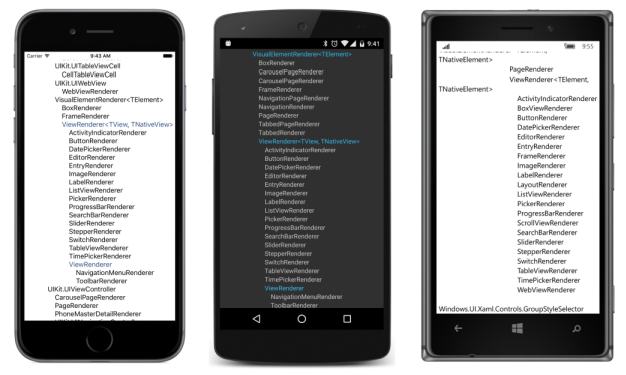

## A hierarquia de classe completa {#a-hierarquia-de-classe-completa}

No Capítulo 11, &quot;A infraestrutura bindable&quot;, você viu um programa chamado **ClassHierarchy** que mostra a hierarquia de classes do Xamarin.Forms. Entretanto, este programa somente mostra os tipos nos assembles **Xamarin.Forms.Core** e **Xamarin.Forms.Xaml**, que são os tipos normalmente utilizados em aplicações Xamarin.Forms.

Xamarin.Forms também contém assembles adicionais associados a cada plataforma. Estes assembles possuem o papel crucial de fazer com que o Xamarin.Forms suporte cada plataforma, incluindo todos os renderizadores

Você provavelmente já está familiarizado com o nome desses montadores de vê-los na seção **Reference** de vários projetos no seu Xamarin.Forms:

*   **Xamarin.Forms.Platform** (muito pequeno)
*   **Xamarin.Forms.Platform.iOS**
*   **Xamarin.Forms.Platform.Android**
*   **Xamarin.Forms.Platform.UAP**
*   **Xamarin.Forms.Platform.WinRT** (maior que os próximos dois seguintes)
*   **Xamarin.Forms.Platform.WinRT.Tablet**
*   **Xamarin.Forms.Platform.WinRT.Phone**

Nesse livro, eles serão referenciados coletivamente como assembles de plataforma.

É possível escrever uma aplicação Xamarin.Forms que mostra uma hierarquia de classes de tipos nesses assembles de plataforma?

Sim! Entretanto, se você se restringiu a examinar somente os assembles normalmente carregados com a aplicação - e esta é certamente a melhor abordagem - então a aplicação pode somente mostrar os tipos no assemble que são parte daquela aplicação. Por exemplo, você só pode mostrar os tipos no assemble **Xamarin.Forms.Plataform.iOS** com um programa Xamarin.Forms rodando no iOS, e similarmente para os outros assembles.

Mas ainda há um problema: Como você deve se lembrar, o programa inicial **ClassHierarchy** começou obtendo objetos Assembly .NET para os assembles **Xamarin.Forms.Core** e **Xamarin.Forms.Xaml** baseados em duas classes (View e Extensions) que ele sabia estar nesses dois assembles:

typeof(View).GetTypeInfo().Assembly

typeof(Extensions).GetTypeInfo().Assembly

Entretanto, uma biblioteca de classes portáveis de uma aplicação Xamarin.Forms não tem acesso direto aos assembles de plataforma. Os assembles de plataforma são referenciados somente pelos projetos da aplicação. Isso significa que uma biblioteca de classes portáveis de um Xamarin.Forms não pode utilizar um código similar para ter uma referência para o assemble de plataforma. Isto não vai funcionar:

typeof(ButtonRenderer).GetTypeInfo().Assembly

Entretanto, estes assembles de plataforma são carregados quando a aplicação roda, de modo que o PCL em vez disso pode obter objectos Assembly para os assembles de plataforma com base no nome assemble. O programa **PlataformClassHierarchy** começa assim:

public partial class PlatformClassHierarchyPage : ContentPage

{

   public PlatformClassHierarchyPage()

   {

       InitializeComponent();

       List&lt;TypeInformation&gt; classList = new List&lt;TypeInformation&gt;();

       string[] assemblyNames = Device.OnPlatform(

           iOS: new string[] { &quot;Xamarin.Forms.Platform.iOS&quot; },

           Android: new string[] { &quot;Xamarin.Forms.Platform.Android&quot; },

           WinPhone: new string[] { &quot;Xamarin.Forms.Platform.UAP&quot;,

                                    &quot;Xamarin.Forms.Platform.WinRT&quot;,

                                    &quot;Xamarin.Forms.Platform.WinRT.Tablet&quot;,

                                    &quot;Xamarin.Forms.Platform.WinRT.Phone&quot; }

           );

       foreach (string assemblyName in assemblyNames)

       {

           try

            {

               Assembly assembly = Assembly.Load(new AssemblyName(assemblyName));

               GetPublicTypes(assembly, classList);

           }

           catch

           {

           }

       }

       …

}

E para o programa **PlataformClassHierarchy** é o mesmo como o programa inicial **ClassHierarchy**.

Como você pode ver o laço foreach obtém o objeto Assembly de um método estático Assembly.Load. Entretanto, não há uma maneira direta para o programa determinar se está executando em um Universal Windows Plataform ou em uma das outras plataformas Windows, então se o Device.OnPlatform indica que é um dispositivo WinPhone, o programa tenta todos quatro assembles e usa o try/cacth somente para ignorar os que não funcionam.

Alguns nomes de classes - e particularmente o nome completo das classes para classes fora do assemble - são um pouco grandes demais para telas no modo retrato e são estranhamente abreviadas, mas aqui está parte da tela nas três plataformas. Cada uma foi rolada para a parte da hierarquia de classes que começa com a classe genérica ViewRenderer. Normalmente esta será a classe que você derivará para criar seu próprio renderizador customizado:

Observe os parâmetros genéricos para a classe ViewRenderer nomeados TView e TNativeView, ou TElement e TNativeElement: como você verá TView ou TElement é um elemento Xamarin.Forms como Button, enquanto TNativeView ou TNativeElement é o controle nativo para o Button.

Apesar do programa **PlataformClassHierarchy** não indicar isto, as restrições para os parâmetros genericos do ViewRenderer são dependentes da plataforma:

*   No iOS:
    *   TView é restringido a Xamarin.Forms.View
    *   TNativeView é restringido a UIKit.UIView
*   No Android:
    *   TView é restringido a Xamarin.Forms.View
    *   TNativeView é restringido a Android.Views.View
*   Na plataforma Windows:
    *   TElement é restringido a Xamarin.Forms.View
    *   TNativeElement é restringido a Windows.UI.Xaml.FrameworkElement

Para escrever um renderizador customizado, você deriva uma classe de ViewRenderer. Para atender todas plataformas, você deve implementar o renderizador iOS usando uma classe que derive de UIView, implementar um renderizador Android com uma classe que derive de View, e implementar um renderizador para a plataforma Windows que derive de FrameworkElement.