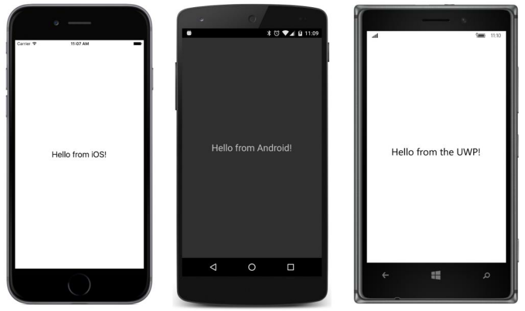

## Olá renderizadores customizados! {#ol-renderizadores-customizados}

O programa **HelloRenderers** demonstra a sobrecarga necessária para escrever um simples renderizador.

O programa define um HelloView derivado de View com a intenção de exibir um texto na tela. Aqui está o arquivo completo HelloView.cs na biblioteca de classes portáveis do projeto **HelloRenderers**:   

using Xamarin.Forms;

namespace HelloRenderers

{

   public class HelloView : View      

   {

   }

}

É isso! Entretanto, note que a classe é definida como public. Apesar de você poder pensar que esta classe é somente referenciada dentro do PCL, este não é o caso. Ela deve estar visível para os assembles da plataforma.

O **HelloRenderers** PCL é tão simples que nem se preocupa com a classe page. Em vez disso ele instancia e apresenta um objeto HelloView centralizado na página direto no arquivo App.cs:

namespace HelloRenderers

{

   public class App : Application

   {

       public App()

       {

           MainPage = new ContentPage

           {

               Content = new HelloView

               {

                   VerticalOptions = LayoutOptions.Center,

                   HorizontalOptions = LayoutOptions.Center

               }

           };

       }

       …

   }

}

Sem outro código qualquer, este programa executa adequadamente, mas na verdade você não verá o objeto HelloView na tela porque ele é transparente. O que precisamos é um renderizador de plataforma para o HelloView.

Quando uma aplicação Xamarin.Forms inicia, o Xamarin.Forms utiliza a reflexão .NET para procurar as vários assembles que compõem o aplicativo, procurando por conjunto atributos nomeados ExportRenderer. Um atributo ExportRenderer indica a presença de um renderizador customizado que pode prover suporte a um elemento Xamarin.Forms.

O projeto **HelloRenderers.iOS** contém um arquivo chamado HelloViewRenderer.cs, apresentado a seguir por completo. Observe o atributo ExportRenderer logo abaixo das diretivas using.  Devido ele ser um atributo de montagem, ele deve ficar fora da declaração do namespace. Basicamente o atributo ExportRenderer diz: &quot;A classe HelloView é suportada por um renderizador do tipo HelloViewRenderer”:

using Xamarin.Forms;

using Xamarin.Forms.Platform.iOS;

using UIKit;

using HelloRenderers;

using HelloRenderers.iOS;

[assembly: ExportRenderer(typeof(HelloView), typeof(HelloViewRenderer))]

namespace HelloRenderers.iOS

{

   public class HelloViewRenderer : ViewRenderer&lt;HelloView, UILabel&gt;

   {

       protected override void OnElementChanged(ElementChangedEventArgs&lt;HelloView&gt; args)

       {

            base.OnElementChanged(args);

           if (Control == null)

           {

               UILabel label = new UILabel

               {

                   Text = &quot;Hello from iOS!&quot;,

                   Font = UIFont.SystemFontOfSize(24)

               };

               SetNativeControl(label);

           }

       }

   }

}

A definição da classe HelloViewRenderer segue o atributo ExportRenderer. A classe deve ser pública. Ela deriva da classe genérica ViewRenderer. Os dois parâmetros genéricos são nomeados TView, que é a classe Xamarin.Forms, e TNativeView, a qual é a classe neste caso que é nativa do iOS.

No iOS, a classe que exibe texto é UILabel no namespace UIKit, e é oque foi usado aqui. Os dois argumentos genericos para ViewRenderer basicamente dizem &quot;O objeto HelloView é atualmente renderizado como um objeto iOS UILabel&quot;.

Um trabalho essencial para um derivado de ViewRenderer é sobrescrever o método OnElementChanged. Este método é chamado quando um objeto HelloView é criado, e seu trabalho é criar um controle nativo para renderizar o objeto HelloView.

O método OnElementChanged sobrescrito começa checando a propriedade Control que a classe herda de ViewRenderer. A propriedade Control é definida pelo ViewRenderer para ser do tipo TNativeView, então no HelloViewRenderer ela é do tipo UILabel. A primeira vez que o método OnElementChanged é chamado, a propriedade Control será null. O objeto UILabel deve ser criado. Isto é que o método faz, atribuindo a ele um texto e um tamanho. Aquele método UILabel é passado para o método SetNativeControl. Depois disso, a propriedade Control será este objeto UILabel.

As diretivas using no começo do arquivo são divididas em três grupos:

*   A diretiva using para o namespace Xamarin.Forms é requerida para o atributo ExportRenderer, enquanto Xamarin.Forms.Plataform.iOS é requerida para a classe ViewRenderer.
*   O namespace iOS UIKit é requerido para o UILabel.
*   As diretivas using para HelloRenderers e HelloRenderers.iOS são requeridas somente para as referências HelloView e HelloViewRenderer no atributo ExportRenderer porque o atributo deve estar fora do bloco do namespace HelloRenderer.iOS.

As últimas duas diretivas using são particularmente irritantes porque eles são somente requeridos para um único propósito. Se você quiser, você pode remover estas duas diretivas e colocar o nome completo das classes dentro do atributo ExportRenderer.

Isto é feito no renderizador a seguir. Aqui está o arquivo completo do HelloViewRenderer.cs do projeto **HelloRenderers.Droid**. O Android widget para exibir texto é TextView no namespace **Andorid.Widget**:

using Xamarin.Forms;

using Xamarin.Forms.Platform.Android;

using Android.Util;

using Android.Widget;

[assembly: ExportRenderer(typeof(HelloRenderers.HelloView),

                         typeof(HelloRenderers.Droid.HelloViewRenderer))]

namespace HelloRenderers.Droid

{

   public class HelloViewRenderer : ViewRenderer&lt;HelloView, TextView&gt;

   {

       protected override void OnElementChanged(ElementChangedEventArgs&lt;HelloView&gt; args)

       {

           base.OnElementChanged(args);

           if (Control == null)

           {

               SetNativeControl(new TextView(Context)

               {

                   Text = &quot;Hello from Android!&quot;

               });

               Control.SetTextSize(ComplexUnitType.Sp, 24);

           }

       }

   }

}

Esta classe HelloViewRenderer deriva da versão do Android de ViewRenderer. Os argumentos genéricos para ViewRenderer indica que a classe e suportada pelo widget Android TextView.

Mais uma vez, na primeira chamada para OnElementChanged, a propriedade Control será null. O método deve criar um widget Android nativo TextView e chamar o método SetNativeControl. Observe que o construtor requer um objeto Android Context. Ele está disponível como uma propriedade de OnElementChanged.

Depois da chamada de SetNativeControl, a propriedade Control definida por ViewRenderer é um widget Android nativo, neste caso um objeto TextView. O método usa esta propriedade Control para chamar SetTextSize no objeto TextView. No Android, o tamanho do texto pode ser escalado de diversas formas. O membro de enumeração ComplexUnitType.Sp indica &quot;scaled pixels&quot;, o qual é compatível como o Xamarin.Forms trata tamanhos de fontes para Label no Android.

Aqui está a versão UWP do HelloRenderer no projeto **HelloRenderers.UWP**

using Xamarin.Forms.Platform.UWP;

using Windows.UI.Xaml.Controls;

[assembly: ExportRenderer (typeof(HelloRenderers.HelloView),  

                          typeof(HelloRenderers.UWP.HelloViewRenderer))]

namespace HelloRenderers.UWP

{

   public class HelloViewRenderer : ViewRenderer&lt;HelloView, TextBlock&gt;

   {

       protected override void OnElementChanged(ElementChangedEventArgs&lt;HelloView&gt; args)

       {

           base.OnElementChanged(args);

           if (Control == null)

           {

               SetNativeControl(new TextBlock

               {

                   Text = &quot;Hello from the UWP!&quot;,

                   FontSize = 24,

               });

           }

       }

   }

}

Em todas plataformas Windows, o objeto HelloView é renderizado pelo Windows Runtime TextBlock no namespace Windows.UI.Xaml.Controls.

A classe HelloViewRenderer nos projetos **HelloRenderers.Windows** e **HelloRenderers.WinPhone** são basicamente a mesma exceto pelo namespace e o texto usado para setar a propriedade Text do TextBlock.

Aqui está o programa rodando nas três plataformas padrão:

Observe como o texto é apropriadamente centralizado pelo uso das propriedades HorizontalOptions e VerticalOptions setadas no objeto HelloView. Entretanto, você não pode setar as propriedades HorizontalTextAlignment e VerticalTextAlignment no HelloView. Estas propriedades são definidas por Label e não pelo HelloView.

Para transformar o HelloView em uma view para exibir texto, você precisara adicionar propriedades à classe HelloView. Vamos examinar como propriedades são adicionadas ao renderizador com um exemplo diferente.