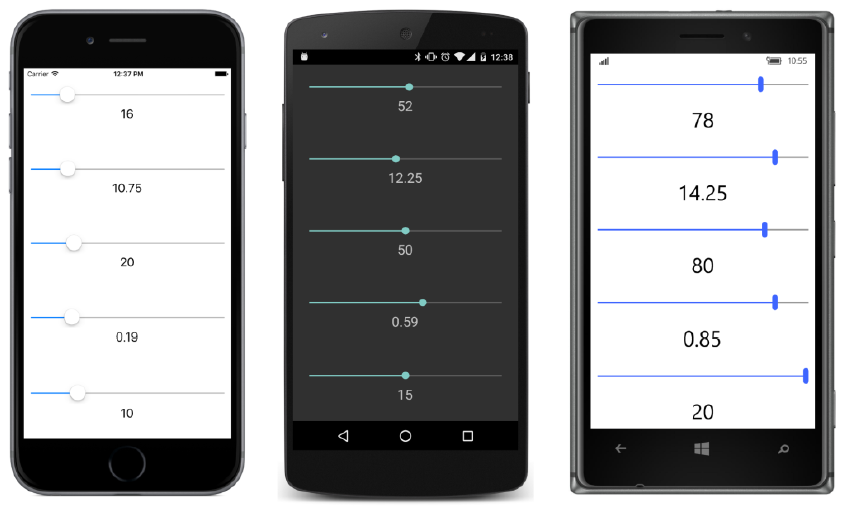

## Renderizadores e eventos {#renderizadores-e-eventos}

A maioria dos elementos Xamarin.Forms são interativos. Eles respondem a entrada do usuário, disparando eventos. Se você implementa um evento em seu elemento Xamarin.Forms personalizado, você provavelmente também precisará definir um evento handler nos renderizadores para o evento correspondente aos disparos de controle nativos. Esta secção irá mostrar-lhe como.

O elemento StepSlider foi inspirado por um problema de implementação do Xamarin.Forms do elemento Windows Slider. Por padrão, o Xamarin.Forms Slider quando executado nas plataformas Windows tem apenas 10 passos de 0 a 1, de modo que só é capaz de Value valor de 0, 0,1, 0,2, e assim por diante até 1,0.

Como o regulares Xamarin.Forms Slider, o elemento StepSlider tem propriedades Minimum, Maximum, e Value, mas também define uma propriedade Step para especificar o número de passos entre Minimum and Maximum. Por exemplo, se Minimum é definida como 5, Maximum é definido como 10, e Step está definido para 20, em seguida, os valores possíveis da propriedade Value são 5,00, 5,25, 5,50, 5,75, 6,00, e assim por diante até 10\. O numero de valores possíveis Value é igual ao valor Step mais 1.

Curiosamente, implementando esta propriedade Step acabou por exigir uma abordagem diferente em todas as três plataformas, mas o objetivo principal deste exercício é para demonstrar como implementar eventos.

Aqui é a classe StepSlider na biblioteca **Xamarin.FormsBook.Platform**. Observe a definição do evento ValueChanged na parte superior e a queima desse evento por mudanças na propriedade Value. Grande parte da maior das definições de propriedades que podem ser ligadas são dedicados aos métodos validateValue, que garantem que a propriedade está dentro de limites aceitáveis, e os métodos CoerceValue, que garantem que as propriedades são consistentes entre si:

namespace Xamarin.FormsBook.Platform

{

public class StepSlider : View

{

public event EventHandler&lt;ValueChangedEventArgs&gt; ValueChanged;

public static readonly BindableProperty MinimumProperty =

BindableProperty.Create(

&quot;Minimum&quot;,

typeof(double),

typeof(StepSlider),

0.0,

validateValue: (obj, min) =&gt; (double)min &lt; ((StepSlider)obj).Maximum,

coerceValue: (obj, min) =&gt;

{

StepSlider stepSlider = (StepSlider)obj;

stepSlider.Value = stepSlider.Coerce(stepSlider.Value,

(double)min,

stepSlider.Maximum);

return min;

});

public static readonly BindableProperty MaximumProperty =

BindableProperty.Create(

&quot;Maximum&quot;,

typeof(double),

typeof(StepSlider),

100.0,

validateValue: (obj, max) =&gt; (double)max &gt; ((StepSlider)obj).Minimum,

coerceValue: (obj, max) =&gt;

{

StepSlider stepSlider = (StepSlider)obj;

stepSlider.Value = stepSlider.Coerce(stepSlider.Value,

stepSlider.Minimum,

(double)max);

return max;

});

public static readonly BindableProperty StepsProperty =

BindableProperty.Create(

&quot;Steps&quot;,

typeof(int),

typeof(StepSlider),

100,

validateValue: (obj, steps) =&gt; (int)steps &gt; 1);

public static readonly BindableProperty ValueProperty =

BindableProperty.Create(

&quot;Value&quot;,

typeof(double),

typeof(StepSlider),

0.0,

BindingMode.TwoWay,

coerceValue: (obj, value) =&gt;

{

StepSlider stepSlider = (StepSlider)obj;

return stepSlider.Coerce((double)value,

stepSlider.Minimum,

stepSlider.Maximum);

},

propertyChanged: (obj, oldValue, newValue) =&gt;

{

StepSlider stepSlider = (StepSlider)obj;

EventHandler&lt;ValueChangedEventArgs&gt; handler = stepSlider.ValueChanged;

if (handler != null)

handler(obj, new ValueChangedEventArgs((double)oldValue,

(double)newValue));

});

public double Minimum

{

set { SetValue(MinimumProperty, value); }

get { return (double)GetValue(MinimumProperty); }

}

public double Maximum

{

set { SetValue(MaximumProperty, value); }

get { return (double)GetValue(MaximumProperty); }

}

public int Steps

{

set { SetValue(StepsProperty, value); }

get { return (int)GetValue(StepsProperty); }

}

public double Value

{

set { SetValue(ValueProperty, value); }

get { return (double)GetValue(ValueProperty); }

}

double Coerce(double value, double min, double max)

{

return Math.Max(min, Math.Min(value, max));

}

}

}

A classe StepSlider dispara a propriedade ValueChanged quando há mudanças na propriedade Value, mas não há nada nesta classe que muda a propriedade Value quando o usuário manipula o renderizador da plataforma para StepSlider. Que é deixado para a classe renderizador.

Mais uma vez, vamos primeiro olhar para a implementação do Windows de StepSliderRenderer no projeto **Xama-rin.FormsBook.Platform.WinRT** compartilhada porque é um pouco mais simples. O renderizador usa o Windows.UI.Xaml.Controls.Slider para o controle nativo. Para evitar um conflito no namespace entre Windows Slider e o Xamarin.Forms Slider, uma using diretiva define a win prefixo para se referir ao namespace Windows e usa isso para fazer referência do Windows Slider:

using System.ComponentModel;

using Xamarin.Forms;

using Win = Windows.UI.Xaml.Controls;

using Windows.UI.Xaml.Controls.Primitives;

#if WINDOWS_UWP

using Xamarin.Forms.Platform.UWP;

#else

using Xamarin.Forms.Platform.WinRT;

#endif

[assembly: ExportRenderer( typeof(Xamarin.FormsBook.Platform.StepSlider),

typeof(Xamarin.FormsBook.Platform.WinRT.StepSliderRenderer))]

namespace Xamarin.FormsBook.Platform.WinRT

{

public class StepSliderRenderer : ViewRenderer&lt;StepSlider, Win.Slider&gt;

{

protected override void OnElementChanged(ElementChangedEventArgs&lt;StepSlider&gt; args) {

{

base.OnElementChanged(args);

if (Control == null)

{

SetNativeControl(new Win.Slider());

}

if (args.NewElement != null)

{

SetMinimum();

SetMaximum();

SetSteps();

SetValue();

Control.ValueChanged += OnWinSliderValueChanged;

}

else

{

Control.ValueChanged -= OnWinSliderValueChanged;

}

}

...

}

}

A grande diferença entre esse renderizador e aquele que você já viu antes é que este define um manipulador de eventos no evento ValueChanged do Windows Slider nativo. (Você verá o manipulador de eventos em breve.) Se args.NewElement torna-se null, no entanto, isso significa que não há mais um elemento Xamarin.Forms anexado ao processador e que o manipulador de eventos não é mais necessário. Além disso, você vai ver em breve que o manipulador de eventos se refere à propriedade Element herdado da classe ViewRenderer, e que a propriedade também será null se args.NewElement é null.

Por essa razão, OnElementChanged destaca o manipulador de eventos quando args.NewElement vem null. Da mesma forma, todos os recursos que você aloca para o representante deve ser liberado sempre que args.NewElement torna-se null.

A substituição do método OnElementPropertyChanged para mudanças nas quatro propriedades que StepSlider define:

namespace Xamarin.FormsBook.Platform.WinRT

{

public class StepSliderRenderer : ViewRenderer&lt;StepSlider, Win.Slider&gt;

{

…

protected override void OnElementPropertyChanged(object sender,

PropertyChangedEventArgs args)

{

base.OnElementPropertyChanged(sender, args);

if (args.PropertyName == StepSlider.MinimumProperty.PropertyName)

{

SetMinimum();

}

else if (args.PropertyName == StepSlider.MaximumProperty.PropertyName)

{

SetMaximum();

}

else if (args.PropertyName == StepSlider.StepsProperty.PropertyName)

{

SetSteps();

}

else if (args.PropertyName == StepSlider.ValueProperty.PropertyName)

{

SetValue();

}

}

…

}

}

Windows Slider define propriedades Minimum, Maximum e Value assim como o Xamarin.Forms Slider e o novo StepSlider. Mas não define uma propriedade Steps. Em vez disso, ela define uma propriedade StepFrequency, que é o oposto de uma propriedade Steps. Para reproduzir o exemplo anterior (Minimum igual a 5, Maximum igual a 10, e Steps igual a 20), você deve definir StepFrequency a 0,25\. A conversão é bastante simples:

namespace Xamarin.FormsBook.Platform.WinRT

{

public class StepSliderRenderer : ViewRenderer&lt;StepSlider, Win.Slider&gt;

{

…

void SetMinimum()

{

Control.Minimum = Element.Minimum;

}

void SetMaximum()

{

Control.Maximum = Element.Maximum;

}

void SetSteps()

{

Control.StepFrequency = (Element.Maximum - Element.Minimum) / Element.Steps;

}

void SetValue()

{

Control.Value = Element.Value;

}

…

}

}

Finalmente, aqui está o manipulador ValueChanged para Windows Slider. Isto tem a responsabilidade de definir a propriedade Value na StepSlider, que, em seguida, dispara seu próprio evento ValueChanged. No entenato, existe um método especial para definir um valor a partir de um renderizador. Este método, chamado SetValueFromRenderer, é definido pela interface IElementController e implementado pela classe Xamarin.Forms Element:

namespace Xamarin.FormsBook.Platform.WinRT

{

public class StepSliderRenderer : ViewRenderer&lt;StepSlider, Win.Slider&gt;

{

…

void OnControlValueChanged(object sender, RangeBaseValueChangedEventArgs args)

{

((IElementController)Element).SetValueFromRenderer(StepSlider.ValueProperty,

args.NewValue);

}

}

}

O iOS UISlider tem propriedades MinValue, MaxValue e Value, e define um evento ValueChanged, mas não tem nada parecido com uma propriedade Steps ou StepFrequency. Em vez disso, a classe iOS StepSliderRenderer em **Xamarin.FormsBook.Platform.iOS** faz um ajuste manual para a propriedade Value antes de chamar SetValueFromRenderer do manipulador de eventos ValueChanged:

using System;

using System.ComponentModel;

using UIKit;

using Xamarin.Forms;

using Xamarin.Forms.Platform.iOS;

[assembly: ExportRenderer(typeof(Xamarin.FormsBook.Platform.StepSlider),

typeof(Xamarin.FormsBook.Platform.iOS.StepSliderRenderer))]

namespace Xamarin.FormsBook.Platform.iOS

{

public class StepSliderRenderer : ViewRenderer&lt;StepSlider, UISlider&gt;

{

int steps;

protected override void OnElementChanged(ElementChangedEventArgs&lt;StepSlider&gt; args)

{

base.OnElementChanged(args);

if (Control == null)

{

SetNativeControl(new UISlider());

}

if (args.NewElement != null)

{

SetMinimum();

SetMaximum();

SetSteps();

SetValue();

Control.ValueChanged += OnUISliderValueChanged;

}

else

{

Control.ValueChanged -= OnUISliderValueChanged;

}

}

protected override void OnElementPropertyChanged(object sender,

PropertyChangedEventArgs args)

{

base.OnElementPropertyChanged(sender, args);

if (args.PropertyName == StepSlider.MinimumProperty.PropertyName)

{

SetMinimum();

}

else if (args.PropertyName == StepSlider.MaximumProperty.PropertyName)

{

SetMaximum();

}

else if (args.PropertyName == StepSlider.StepsProperty.PropertyName)

{

SetSteps();

}

else if (args.PropertyName == StepSlider.ValueProperty.PropertyName)

{

SetValue();

}

}

void SetMinimum()

{

Control.MinValue = (float)Element.Minimum;

}

void SetMaximum()

{

Control.MaxValue = (float)Element.Maximum;

}

void SetSteps()

{

steps = Element.Steps;

}

void SetValue()

{

Control.Value = (float)Element.Value;

}

void OnUISliderValueChanged(object sender, EventArgs args)

{

double increment = (Element.Maximum - Element.Minimum) / Element.Steps;

double value = increment * Math.Round(Control.Value / increment);

((IElementController)Element).SetValueFromRenderer(StepSlider.ValueProperty, value);

}

}

}

Curiosamente, o widget SeekBar Android tem um equivalente à propriedade Steps mas não é equivalente à propriedades Minimum e Maximum! Como isso é possível? O SeekBar realmente define uma propriedade integer chamada Max, e a propriedade Progress da SeekBar é sempre um número inteiro que varia de 0 a Max. Assim, a propriedade Max realmente indica o número de steps a SeekBar pode fazer, e é necessária uma conversão entre a propriedade Progress da SeekBar e a propriedade Value do StepSlider.

Esta conversão ocorre em dois lugares: O método SetValue converte a partir da propriedade Value do StepSlider à propriedade Progress da SeekBar, e o método OnProgressChanged converte a partir da propriedade Progress da SeekBar para a propriedade Value da StepSlider.

Além disso, o processador de eventos é um pouco diferente. O método SetOnSeekBarChangeListener aceita um argumento do tipo IOnSeekBarChangeListener, que define três métodos que reportam alterações no Seekbar, incluindo o método OnProgressChanged. O renderizador por si mesmo implementa essa interface.

Aqui está a classe StepSliderRenderer completa na biblioteca **Xamarin.FormsBook.Platform.Android**:

using System.ComponentModel;

using Android.Widget;

using Xamarin.Forms;

using Xamarin.Forms.Platform.Android;

[assembly: ExportRenderer(typeof(Xamarin.FormsBook.Platform.StepSlider),

typeof(Xamarin.FormsBook.Platform.Android.StepSliderRenderer))]

namespace Xamarin.FormsBook.Platform.Android

{

public class StepSliderRenderer : ViewRenderer&lt;StepSlider, SeekBar&gt;,

SeekBar.IOnSeekBarChangeListener

{

double minimum, maximum;

protected override void OnElementChanged(ElementChangedEventArgs&lt;StepSlider&gt; args)

{

base.OnElementChanged(args);

if (Control == null)

{

SetNativeControl(new SeekBar(Context));

}

if (args.NewElement != null)

{

SetMinimum();

SetMaximum();

SetSteps();

SetValue();

Control.SetOnSeekBarChangeListener(this);

}

else

{

Control.SetOnSeekBarChangeListener(null);

}

}

protected override void OnElementPropertyChanged(object sender,

PropertyChangedEventArgs args)

{

base.OnElementPropertyChanged(sender, args);

if (args.PropertyName == StepSlider.MinimumProperty.PropertyName)

{

SetMinimum();

}

else if (args.PropertyName == StepSlider.MaximumProperty.PropertyName)

{

SetMaximum();

}

else if (args.PropertyName == StepSlider.StepsProperty.PropertyName)

{

SetSteps();

}

else if (args.PropertyName == StepSlider.ValueProperty.PropertyName)

{

SetValue();

}

}

void SetMinimum()

{

minimum = Element.Minimum;

}

void SetMaximum()

{

maximum = Element.Maximum;

}

void SetSteps()

{

Control.Max = Element.Steps;

}

void SetValue()

{

double value = Element.Value;

Control.Progress = (int)((value - minimum) / (maximum - minimum) * Element.Steps);

}

// Implementation of SeekBar.IOnSeekBarChangeListener

public void OnProgressChanged(SeekBar seekBar, int progress, bool fromUser)

{

double value = minimum + (maximum - minimum) * Control.Progress / Control.Max;

((IElementController)Element).SetValueFromRenderer(StepSlider.ValueProperty, value);

}

public void OnStartTrackingTouch(SeekBar seekBar)

{

}

public void OnStopTrackingTouch(SeekBar seekBar)

{

}

}

}

A solução **StepSliderDemo** contém links para as bibliotecas **Xamarin.FormsBook.Platform** e correspondente a referências a essas bibliotecas. O arquivo StepSliderDemo.xaml instancia cinco elementos StepSlider, com ligações de dados em três deles e um manipulador de eventos explícito sobre os outros dois:

&lt;ContentPage xmlns=”http://xamarin.com/schemas/2014/forms”

xmlns:x=”http://schemas.microsoft.com/winfx/2009/xaml”

xmlns:platform= &quot;clr-namespace:Xamarin.FormsBook.Platform;assembly=Xamarin.FormsBook.Platform&quot;

x:Class=&quot;StepSliderDemo.StepSliderDemoPage&quot;&gt;

&lt;StackLayout Padding=&quot;10, 0&quot;&gt;

&lt;StackLayout.Resources&gt;

&lt;ResourceDictionary&gt;

&lt;Style TargetType=&quot;ContentView&quot;&gt;

&lt;Setter Property=&quot;VerticalOptions&quot; Value=&quot;CenterAndExpand&quot; /&gt;

&lt;/Style&gt;

&lt;Style TargetType=&quot;Label&quot;&gt;

&lt;Setter Property=&quot;FontSize&quot; Value=&quot;Large&quot; /&gt;

&lt;Setter Property=&quot;HorizontalOptions&quot; Value=&quot;Center&quot; /&gt;

&lt;/Style&gt;

&lt;/ResourceDictionary&gt;

&lt;/StackLayout.Resources&gt;

&lt;ContentView&gt;

&lt;StackLayout&gt;

&lt;platform:StepSlider x:Name=&quot;stepSlider1&quot; /&gt;

&lt;Label Text=&quot;{Binding Source={x:Reference stepSlider1}, Path=Value}&quot; /&gt;

&lt;/StackLayout&gt;

&lt;/ContentView&gt;

&lt;ContentView&gt;

&lt;StackLayout&gt;

&lt;platform:StepSlider x:Name=&quot;stepSlider2&quot;

Minimum=&quot;10&quot;

Maximum=&quot;15&quot;

Steps=&quot;20&quot;

ValueChanged=&quot;OnSliderValueChanged&quot; /&gt;

&lt;Label x:Name=&quot;label2&quot; /&gt;

&lt;/StackLayout&gt;

&lt;/ContentView&gt;

&lt;ContentView&gt;

&lt;StackLayout&gt;

&lt;platform:StepSlider x:Name=&quot;stepSlider3&quot;

Steps=&quot;10&quot; /&gt;

&lt;Label Text=&quot;{Binding Source={x:Reference stepSlider3}, Path=Value}&quot; /&gt;

&lt;/StackLayout&gt;

&lt;/ContentView&gt;

&lt;ContentView&gt;

&lt;StackLayout&gt;

&lt;platform:StepSlider x:Name=&quot;stepSlider4&quot;

Minimum=&quot;0&quot;

Maximum=&quot;1&quot;

Steps=&quot;100&quot;

ValueChanged=&quot;OnSliderValueChanged&quot; /&gt;

&lt;Label x:Name=&quot;label4&quot; /&gt;

&lt;/StackLayout&gt;

&lt;/ContentView&gt;

&lt;ContentView&gt;

&lt;StackLayout&gt;

&lt;platform:StepSlider x:Name=&quot;stepSlider5&quot;

Minimum=&quot;10&quot;

Maximum=&quot;20&quot;

Steps=&quot;2&quot; /&gt;

&lt;Label Text=&quot;{Binding Source={x:Reference stepSlider5}, Path=Value}&quot; /&gt;

&lt;/StackLayout&gt;

&lt;/ContentView&gt;

&lt;/StackLayout&gt;

&lt;/ContentPage&gt;

O arquivo code-behind tem o manipulador de eventos ValueChanged:

public partial class StepSliderDemoPage : ContentPage

{

public StepSliderDemoPage()

{

InitializeComponent();

}

void OnSliderValueChanged(object sender, ValueChangedEventArgs args)

{

StepSlider stepSlider = (StepSlider)sender;

if (stepSlider == stepSlider2)

{

label2.Text = stepSlider2.Value.ToString();

}

else if (stepSlider == stepSlider4)

{

label4.Text = stepSlider4.Value.ToString();

}

}

}

Você verá que as funções StepSlider como um Xamarin.Forms Slider normal, exceto que os possíveis valores do StepSlider estão agora sob controle programático:

O primeiro StepSlider tem propriedades Value em incrementos de 1, o segundo em incrementos de 0,25, a terceira em incrementos de 10, a quarta em incrementos de 0,01, e o quinto em incrementos de 5 com apenas três configurações possíveis.

E agora você pode ver como Xamarin.Forms fornece as ferramentas que permitem levá-lo além do que à primeira vista parece ser. Qualquer coisa que você pode definir em três plataformas pode se tornar algo útil em apenas uma plataforma universal. Com a linguagem de programação C #, e o poder de Xamarin.Forms e renderizadores, você pode entrar não só na programação iOS, ou programação Android, ou de programação do Windows, mas todas as três de uma vez com uma única etapa, e continuar com um passo para o futuro do desenvolvimento móvel.

**Sobre o autor**

Charles Petzold trabalha para Xamarin na equipe de documentação. Seus primeiros anos como freelancer foram gastos em grande parte, escrevendo livros para a Microsoft Press sobre programação Windows, Windows Phone e .NET, incluindo seis edições da programação lendária do Windows, de 1988 a 2012.

Petzold é também o autor de dois livros exclusivos sobre os fundamentos matemáticos e filosóficos da computação digital, computing, _Code: The Hidden Language of Computer Hardware and Software_ (Microsoft Press, 1999) e _The Annotated Turing: A Guided Tour through Alan Turing&#039;s Historic Paper on Computability and the Turing Machine_ (Wiley, 2008). Ele mora em Nova York com sua esposa, a escritora Deirdre Sinnott.