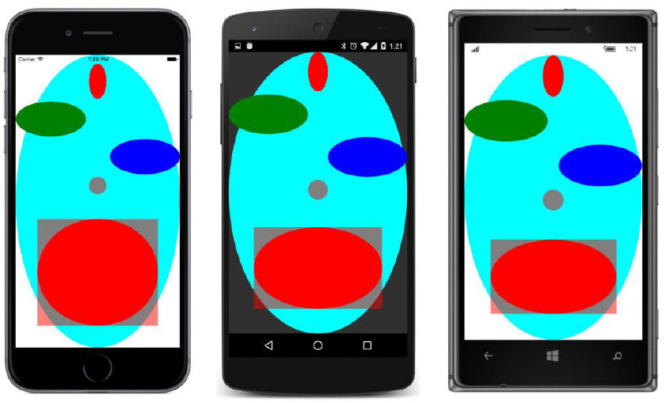

## Renderizadores e propriedades {#renderizadores-e-propriedades}

Xamarin.Forms inclui um elemento BoxView para exibir blocos retangulares coloridos. Você já desejou ter algo parecido para desenhar um círculo, ou para ser mais genérico, uma elipse?

Este é o propósito do EllipseView. Entretanto, como você pode querer utilizar o EllipseView em múltiplas aplicações, ele é implementado na biblioteca **Xamarin.FormsBook.Plataform**, apresentado no capítulo 20, &quot;Assincronismo e I/O de arquivo.&quot;  

BoxView define uma propriedade - a propriedade Color do tipo Color - e EllipseView pode fazer o mesmo. Ele não precisa de propriedades para definir a largura e altura da elipse porque ele herda de WidthRequest e HeightRequest de VisualElement.

Então aqui está um EllipseView como definida na biblioteca do projeto **Xamarin.FormsBook.Plataform**

namespace Xamarin.FormsBook.Platform

{

   public class EllipseView : View

   {

       public static readonly BindableProperty ColorProperty =

           BindableProperty.Create(

               &quot;Color&quot;,

               typeof(Color),

               typeof(EllipseView),

               Color.Default);

       public Color Color

       {

           set { SetValue(ColorProperty, value); }

           get { return (Color)GetValue(ColorProperty); }

       }

       protected override SizeRequest OnSizeRequest(double widthConstraint,  

                                                    double heightConstraint)

       {

           return new SizeRequest(new Size(40, 40));

       }

   }

}

A propriedade Color simplesmente envolve uma definição básica de uma propriedade ligável sem um manipulador de troca de propriedade. A propriedade é definida, mas não parece estar fazendo nada. De algum modo a propriedade Color definida em EllipseView tem que ser ligada com a propriedade no objeto que o renderizador está renderizando.

O único outro código no EllipseView é o método sobrescrito OnSizeRequest para definir o tamanho padrão da elipse, do mesmo modo como em BoxView.

Vamos começar com a plataforma Windows. Acontece que o renderizador Windows para EllipseView é mais simples que os renderizadores para iOS e Android.

Como você se lembra, a solução **Xamarin.FormsBook.Plataform** criada no capítulo 20 tem a facilidade de permitir o compartilhamento de código entre as várias plataformas Windows: a biblioteca **Xamarin.FormsBook.Plataform.UWP**, a biblioteca **Xamarin.FormsBook.Plataform.Windows**, e a biblioteca **Xamarin.FormsBook.Plataform.WinPhone** todas tem referências para a biblioteca **Xamarin.FormsBook.Plataform.WinRT**, a qual não é absolutamente uma biblioteca mas um projeto compartilhado. Este projeto compartilhado é onde a classe ViewRenderer para todas as plataformas Windows pode residir.

Nas plataformas Windows, um EllipseView pode ser renderizado por um elemento Windows nativo chamado Ellipse no namespace Windows.UI.Xaml.Shapes, porque o Ellipse satisfaz o critério de derivar de Windows.UI.Xaml.FrameworkElement.

O Ellipse é especificado como o segundo argumento genérico para a classe ViewRenderer. Como este arquivo é compartilhado por todas plataformas Windows, ele precisa pré-processar as diretivas para incluir o namespace correto para as classes ExportRendererAttribute e ViewRenderer.

using System.ComponentModel;

using Windows.UI.Xaml.Media;

using Windows.UI.Xaml.Shapes;

#if WINDOWS_UWP

using Xamarin.Forms.Platform.UWP;

#else

using Xamarin.Forms.Platform.WinRT;

#endif

[assembly: ExportRenderer(typeof(Xamarin.FormsBook.Platform.EllipseView),  

                         typeof(Xamarin.FormsBook.Platform.WinRT.EllipseViewRenderer))]

namespace Xamarin.FormsBook.Platform.WinRT

{

   public class EllipseViewRenderer : ViewRenderer&lt;EllipseView, Ellipse&gt;

   {

       protected override void OnElementChanged(ElementChangedEventArgs&lt;EllipseView&gt; args)

       {

           base.OnElementChanged(args);

           if (Control == null)

           {

               SetNativeControl(new Ellipse());

           }

           if (args.NewElement != null)

           {

               SetColor();

           }

       }

       …

   }

}

Como você poderia esperar por agora, o OnElementChanged sobrescrito primeiro verifica se a propriedade Control é null, e em caso afirmativo, ele cria o objeto nativo, neste caso, uma Ellipse, e passa para SetNativeControl. Depois disso, a propriedade Control é definida para este objeto Ellipse.

No método OnElementChanged sobrescrito também contém algum código adicional envolvendo o argumento ElementChangedEventArgs. Ele requer uma pequena explicação:

Cada instância do renderizador - neste exemplo, uma instância da classe EllipseViewRenderer - mantém uma instância única do objeto nativo, neste exemplo o Ellipse.

No entanto, a infraestrutura de renderização tem uma facilidade tanto para anexar uma instância renderizador para um elemento Xamarin.Forms e para retirá-la e anexar um outro elemento Xamarin.Forms para o mesmo renderizador. Talvez Xamarin.Forms precise recriar o elemento ou substituir outro elemento para o já associado com o renderizador.

Mudanças desse tipo são comunicadas ao renderizador com chamadas para OnElementChanged. O argumento ElementChangedEventArgs inclui duas propriedades, OldElement e NewElement, tanto do tipo indicado no argumento genérico para ElementChangedEventArgs, neste caso EllipseView. Em muitos casos, você não precisa se preocupar com diferentes elementos Xamarin.Forms sendo conectados e desconectados de uma única instância renderizador. Mas, em alguns casos, você pode querer usar a oportunidade de limpar ou liberar alguns recursos que o seu renderizador usa.

No caso mais simples e mais comum, cada instância do processador irá receber uma chamada para OnElementChanged para o Xamarin.Forms ver que usa esse renderizador. Você vai usar a chamada para OnElementChanged para criar o elemento nativo e passá-lo para SetNativeControl, como você já viu. Após essa chamada para SetNativeControl, a propriedade de Control definido pelo ViewRenderer é o objeto nativo, neste caso, o Ellipse.

No momento que você começa a receber a chamada para OnElementChanged, o objeto Xamarin.Forms (neste caso, um EllipseView) provavelmente já foi criado e que também pode ter algumas propriedades definidas. (Em outras palavras, o elemento pode ser inicializado com algumas configurações de propriedade no momento em que o renderizador é exigido para exibir o elemento.) Mas o sistema é concebido de modo que este não é necessariamente o caso. É possível que uma chamada subsequente para OnElementChanged indica que um EllipseView foi criado.

O que interessa é a propriedade NewElement dos argumentos do evento. Se essa propriedade não é null (que é o caso normal), esta a propriedade é o elemento Xamarin.Forms, e você deve transferir as definições de propriedade desse elemento Xamarin.Forms para o objeto nativo. Esse é o propósito da chamada para o método SetColor mostrado acima. Você vai ver o corpo desse método em breve.

O ViewRenderer define uma propriedade chamada Element que define o elemento Xamarin.Forms, neste caso, um EllipseView. Se a chamada mais recente para OnElementChanged continha uma propriedade NewElement não nulo, então Element é o mesmo objeto.

Resumindo, estas são as duas propriedades essenciais que você pode usar na sua classe de renderização:

*   Element - o elemento Xamarin.Forms, válido se a chamada OnElementChanged mais recente tinha uma propriedade NewElement não nula.
*   Control - a view nativa, ou widget, ou objeto control, válido após uma chamada para SetNativeView.

Como você sabe, as propriedades dos elementos Xamarin.Forms podem mudar. Por exemplo, a propriedade Color de EllipseView pode ser animada. Se uma propriedade, tal como Color é apoiado por uma propriedade ligável, qualquer alteração a essa propriedade faz com que um evento PropertyChanged ser disparado.

O renderizador também é notificado da mudança de propriedade. Qualquer alteração a uma propriedade ligável em um elemento Xamarin.Forms ligado a um renderizador também faz uma chamada para o método protegido virtual OnElementPropertyChanged na classe ViewRenderer. Neste exemplo em particular, qualquer alteração a qualquer propriedade ligável em EllipseView (incluindo a propriedade Color) gera uma chamada para OnElementPropertyChanged. Seu renderizador deve sobrescrever esse método e verificar que a propriedade mudou:

namespace Xamarin.FormsBook.Platform.WinRT

{

   public class EllipseViewRenderer : ViewRenderer&lt;EllipseView, Ellipse&gt;

    {

       …

       protected override void OnElementPropertyChanged(object sender,  

                                                        PropertyChangedEventArgs args)

       {

           base.OnElementPropertyChanged(sender, args);

           if (args.PropertyName == EllipseView.ColorProperty.PropertyName)

           {

               SetColor();

           }

       }

       …

   }

}

Se a propriedade Color mudou, a propriedade PropertyName do argumento do evento é &quot;Color&quot;, o nome do texto especificado quando a propriedade ligável EllipseView.ColorProperty foi criada. Mas, para evitar erro de ortografia do nome, o método OnElementPropertyChanged verifica o atual valor do texto na propriedade ligável. O renderizador deve responder ao transferir essa nova configuração da propriedade Color para o objeto nativo, neste caso, o objeto do Windows Ellipse.

Este método SetColor é chamado de apenas dois lugares - no método sobrescrito OnElementChanged e no método sobrescrito OnElementPropertyChanged. Não pense que você pode ignorar a chamada em OnElementChanged sob a suposição de que a propriedade não foi alterada antes da chamada para OnElementChanged. É muito frequentemente o caso que OnElementChanged é chamado após que um elemento foi inicializado com as configurações de propriedade.

No entanto, SetColor pode fazer algumas suposições válidas sobre a existência do elemento Xamarin.Forms e o controle nativo: Quando SetColor é chamado a partir OnElementChanged, o controle nativo foi criado e NewElement não é null. Isto significa que ambas as propriedades, Control e Element são válidas. A propriedade Element também é válida quando OnElementPropertyChanged é chamado porque é o objeto cuja propriedade acaba de mudar.

Isto significa que o método SetColor pode simplesmente transferir uma cor de Element (o elemento Xamarin.Forms) para Control, o objeto nativo. Para evitar conflitos de namespace, este método SetColor qualifica plenamente todas as referências a qualquer estrutura chamada Color:

namespace Xamarin.FormsBook.Platform.WinRT

{

   public class EllipseViewRenderer : ViewRenderer&lt;EllipseView, Ellipse&gt;

   {

       …

       void SetColor()

       {

           if (Element.Color == Xamarin.Forms.Color.Default)

           {

               Control.Fill = null;

           }

           else

           {

               Xamarin.Forms.Color color = Element.Color;

               global::Windows.UI.Color winColor =

                   global::Windows.UI.Color.FromArgb((byte)(color.A * 255),

                                                     (byte)(color.R * 255),

                                                     (byte)(color.G * 255),

                                                     (byte)(color.B * 255));

               Control.Fill = new SolidColorBrush(winColor);

           }

       }

   }

}

O objeto do Windows Ellipse tem uma propriedade denominada de Fill do tipo Brush. Por padrão, essa propriedade é null, e é isso que o método SetColor define se a propriedade Color de EllipseView é Color.Default. Caso contrário, Xamarin.Forms Color deve ser convertida para um Windows Color, que é então passada para o construtor de SolidColorBrush. Os objetos SolidColorBrush é definido para a propriedade Fill de Ellipse.

Essa é a versão Windows, mas quando chega a hora de criar renderizadores iOS e Android para EllipseView, você pode sentir um pouco frustrado. Aqui, novamente, são as restrições para o segundo parâmetro genérico para ViewRenderer:

*   iOS: TNativeView é forçado para UIKit.UIView
*   Android: TNativeView é forçado para Android.View.Views
*   Windows: TNativeElement é forçado para Windows.UI.Xaml.FrameworkElement

Isto significa que para fazer um renderizador EllipseView para iOS, você precisa de um UIView derivado que exibe uma elipse. Será que algo assim existe? Não, não existe. Portanto, você deve fazer um você mesmo. Este é o primeiro passo para fazer o renderizador iOS.

Por essa razão, a biblioteca Xamarin.FormsBook.Platform.iOS contém uma classe chamada EllipseUIView que deriva de UIView com o único propósito de desenhar uma elipse:

using CoreGraphics;

using UIKit;

namespace Xamarin.FormsBook.Platform.iOS

{

   public class EllipseUIView : UIView

   {

       UIColor color = UIColor.Clear;

       public EllipseUIView()

       {

           BackgroundColor = UIColor.Clear;

       }

        public override void Draw(CGRect rect)

       {

           base.Draw(rect);

           using (CGContext graphics = UIGraphics.GetCurrentContext())

           {

               //Create ellipse geometry based on rect field.

               CGPath path = new CGPath();

               path.AddEllipseInRect(rect);

               path.CloseSubpath();

               //Add geometry to graphics context and draw it.

               color.SetFill();

               graphics.AddPath(path);

               graphics.DrawPath(CGPathDrawingMode.Fill);

           }

       }

       public void SetColor(UIColor color)

       {

           this.color = color;

           SetNeedsDisplay();

       }

   }

}

A classe sobrescreve o método OnDraw para criar um caminho gráfico de uma elipse e depois desenhá-la no contexto gráfico. A cor que utiliza é armazenada como um campo e é inicialmente ajustado para UIColor.Clear, que é transparente. No entanto, você vai notar um método SetColor na parte inferior. Isto proporciona nova cor para a classe e, em seguida, chama SetNeedsDisplay, o que invalida a superfície de desenho e gera outra chamada para OnDraw.

Observe também que o BackgroundColor do UIView é definido no construtor para UIColor.Clear. Sem esse ajuste, a exibição tem um fundo preto na área não coberta pela elipse.

Agora que existe a classe EllipseUIView para iOS, o EllipseViewRenderer pode ser escrito usando EllipseUIView como o controle nativo. Estruturalmente, esta classe é praticamente idêntica ao renderizador do Windows:

using System.ComponentModel;

using UIKit;

using Xamarin.Forms;

using Xamarin.Forms.Platform.iOS;

[assembly: ExportRenderer(typeof(Xamarin.FormsBook.Platform.EllipseView),  

                         typeof(Xamarin.FormsBook.Platform.iOS.EllipseViewRenderer))]

namespace Xamarin.FormsBook.Platform.iOS

{

   public class EllipseViewRenderer : ViewRenderer&lt;EllipseView, EllipseUIView&gt;

{

protected override void OnElementChanged(ElementChangedEventArgs&lt;EllipseView&gt; args)

{

base.OnElementChanged(args);

if (Control == null)

{

SetNativeControl(new EllipseUIView());

}

if (args.NewElement != null)

{

SetColor();

}

}

protected override void OnElementPropertyChanged(object sender, PropertyChangedEventArgs args)

{

base.OnElementPropertyChanged(sender, args);

if (args.PropertyName == EllipseView.ColorProperty.PropertyName)

{

SetColor();

}

}

void SetColor()

{

if (Element.Color != Color.Default)

{

Control.SetColor(Element.Color.ToUIColor());

}

else

{

Control.SetColor(UIColor.Clear);

}

}

}

}

As únicas diferenças reais entre este renderizador e a versão do Windows é que a propriedade de Control é definida como uma instancia de ColorUIView, e o corpo do método SetColor na parte inferior é diferente. Ele agora chama o método SetColor em ColorUIView. Este método SetColor também é capaz de fazer uso de um método público de extensão na biblioteca **Xamarin.Forms.Platform.iOS** chamado ToUIColor para converter uma cor Xamarin.Forms para uma cor iOS.

Você deve ter notado que nem o representante do Windows nem o renderizador iOS teve que se preocupar sobre o dimensionamento. Como você verá em breve, uma EllipseView pode ser ajustada para uma variedade de tamanhos, e o tamanho calculado no sistema de layout Xamarin.Forms torna-se o tamanho do controle nativo.

Esta, infelizmente, acabou por não ser o caso com o renderizador Android. O renderizador Android precisa de alguma lógica de dimensionamento. Como iOS, Android também está faltando um controle nativo que torna uma elipse. Portanto, a biblioteca **Xamarin.FormsBook.Platform.Android** contém uma classe chamada EllipseDrawableView que deriva de View e desenha uma elipse:

using Android.Content;

using Android.Views;

using Android.Graphics.Drawables;

using Android.Graphics.Drawables.Shapes;

using Android.Graphics;

namespace Xamarin.FormsBook.Platform.Android

{

public class EllipseDrawableView : View

{

ShapeDrawable drawable;

public EllipseDrawableView(Context context) : base(context)

{

drawable = new ShapeDrawable(new OvalShape());

}

protected override void OnDraw(Canvas canvas)

{

base.OnDraw(canvas);

drawable.Draw(canvas);

}

public void SetColor(Xamarin.Forms.Color color)

{

drawable.Paint.SetARGB((int)(255 * color.A),

(int)(255 * color.R),

(int)(255 * color.G),

(int)(255 * color.B));

Invalidate();

}

public void SetSize(double width, double height)

{

float pixelsPerDip = Resources.DisplayMetrics.Density;

drawable.SetBounds(0, 0, (int)(width * pixelsPerDip),

(int)(height * pixelsPerDip));

Invalidate();

}

}

}

Estruturalmente, este é semelhante à classe EllipseUIView definido para iOS, exceto que o construtor cria um objeto ShapeDrawable para uma elipse, e o OnDraw substitui o renderizadores.

Essa classe tem dois métodos para definir as propriedades desta elipse. O método SetColor converte um Xamarin.Forms de cor para definir a propriedade de Paint do objeto ShapeDrawable, e o método SetSize converte um tamanho em unidades independentes de dispositivo de pixels para a definição dos limites do objeto ShapeDrawable. Ambos SetColor e SetSize conclui com uma chamada para Invalidate para invalidar a superfície de desenho e gerar outra chamada para OnDraw.

O renderizador Android faz uso da classe EllipseDrawableView como seu objeto nativo:

using System.ComponentModel;

using Xamarin.Forms;

using Xamarin.Forms.Platform.Android;

[assembly: ExportRenderer(typeof(Xamarin.FormsBook.Platform.EllipseView),

typeof(Xamarin.FormsBook.Platform.Android.EllipseViewRenderer))]

namespace Xamarin.FormsBook.Platform.Android

{

public class EllipseViewRenderer : ViewRenderer&lt;EllipseView, EllipseDrawableView&gt;

{

double width, height;

protected override void OnElementChanged(ElementChangedEventArgs&lt;EllipseView&gt; args)

{

base.OnElementChanged(args);

if (Control == null)

{

SetNativeControl(new EllipseDrawableView(Context));

}

if (args.NewElement != null)

{

SetColor();

SetSize();

}

}

protected override void OnElementPropertyChanged(object sender,

PropertyChangedEventArgs args)

{

base.OnElementPropertyChanged(sender, args);

if (args.PropertyName == VisualElement.WidthProperty.PropertyName)

{

width = Element.Width;

SetSize();

}

else if (args.PropertyName == VisualElement.HeightProperty.PropertyName)

{

height = Element.Height;

SetSize();

}

else if (args.PropertyName == EllipseView.ColorProperty.PropertyName)

{

SetColor();

}

}

void SetColor()

{

Control.SetColor(Element.Color);

}

void SetSize()

{

Control.SetSize(width, height);

}

}

}

Observe que o método OnElementPropertyChanged precisa verificar se há alterações nas propriedades Width e Height, e guardá-las em campos que podem ser combinados em um único Bounds de definição para a chamada SetSize para EllipseDrawableView.

Com todos os renderizadores no lugar, é hora de ver se ele funciona. A solução **EllipseDemo** também contém links para os vários projetos da solução **Xamarin.FormsBook.Platform**, e cada um dos projetos em **EllipseDemo** contém uma referência para o projeto de biblioteca correspondente no **Xamarin.Forms-Book.Platform**.

Cada um dos projectos em **EllipseDemo** também contém uma chamada para o método Toolkit.Init na biblioteca correspondente. Isto nem sempre é necessário. Mas tenha em mente que os vários renderers não estão diretamente referenciados por qualquer código em qualquer um dos projetos, e algumas otimizações podem fazer com que o código não esteja disponível em tempo de execução. A chamada para Toolkit.Init evita isso.

O arquivo XAML em **EllipseDemo** cria vários objetos EllipseView com diferentes cores e tamanhos, alguns limitados em tamanho, enquanto outros são permitidos para preencher seu container:

&lt;?xml version=&quot;1.0&quot; encoding=&quot;utf-8&quot; ?&gt;

&lt;ContentPage xmlns=”http://xamarin.com/schemas/2014/forms”

xmlns:x=”http://schemas.microsoft.com/winfx/2009/xaml”

xmlns:platform=

&quot;clr-namespace:Xamarin.FormsBook.Platform;assembly=Xamarin.FormsBook.Platform&quot;

x:Class=&quot;EllipseDemo.EllipseDemoPage&quot;&gt;

&lt;Grid&gt;

&lt;platform:EllipseView Color=&quot;Aqua&quot; /&gt;

&lt;StackLayout&gt;

&lt;StackLayout.Padding&gt;

&lt;OnPlatform x:TypeArguments=&quot;Thickness&quot;

iOS=&quot;0, 20, 0, 0&quot; /&gt;

&lt;/StackLayout.Padding&gt;

&lt;platform:EllipseView Color=&quot;Red&quot;

WidthRequest=&quot;40&quot;

HeightRequest=&quot;80&quot;

HorizontalOptions=&quot;Center&quot; /&gt;

&lt;platform:EllipseView Color=&quot;Green&quot;

WidthRequest=&quot;160&quot;

HeightRequest=&quot;80&quot;

HorizontalOptions=&quot;Start&quot; /&gt;

&lt;platform:EllipseView Color=&quot;Blue&quot;

WidthRequest=&quot;160&quot;

HeightRequest=&quot;80&quot;

HorizontalOptions=&quot;End&quot; /&gt;

&lt;platform:EllipseView Color=&quot;#80FF0000&quot;

HorizontalOptions=&quot;Center&quot; /&gt;

&lt;ContentView Padding=&quot;50&quot;

VerticalOptions=&quot;FillAndExpand&quot;&gt;

&lt;platform:EllipseView Color=&quot;Red&quot;

BackgroundColor=&quot;#80FF0000&quot; /&gt;

&lt;/ContentView&gt;

&lt;/StackLayout&gt;

&lt;/Grid&gt;

&lt;/ContentPage&gt;

Tome nota em particular do penúltimo EllipseView que se dá pela cor vermelha semi-opaca. Contra Aqua da grande elipse encher a página, isso deve processar como cinza médio.

A última EllipseView dá-se uma configuração BackgroundColor de vermelho meio-opaco. Novamente, isso deve processar como cinza contra a grande elipse Aqua, mas como uma luz vermelha sobre um fundo branco e vermelho escuro contra um fundo preto. Aqui estão eles:

Depois de ter um EllipseView, é claro que você vai querer escrever um programa de salto-bola. A solução **BouncingBall** também inclui links para todos os projetos na solução **Xamarin.FormsBook.Platform**, e todos os projetos de aplicativos têm referências aos projetos de biblioteca correspondentes. O **BouncingBall** PCL tem também uma referência à biblioteca **Xamarin.FormsBook.Toolkit** para uma estrutura chamada Vector2, um vector bidimensional.

O arquivo XAML posiciona um EllipseView no centro da página:

&lt;ContentPage xmlns=&quot;http://xamarin.com/schemas/2014/forms&quot;

xmlns:x=”http://schemas.microsoft.com/winfx/2009/xaml”

xmlns:platform=

&quot;clr-namespace:Xamarin.FormsBook.Platform;assembly=Xamarin.FormsBook.Platform&quot;

x:Class=&quot;BouncingBall.BouncingBallPage&quot;&gt;

&lt;platform:EllipseView x:Name=&quot;ball&quot;

WidthRequest=&quot;100&quot;

HeightRequest=&quot;100&quot;

HorizontalOptions=&quot;Center&quot;

VerticalOptions=&quot;Center&quot; /&gt;

&lt;/ContentPage&gt;

O arquivo code-behind inicia-se duas animações que correm &quot;para sempre&quot;. A primeira animação é definida no construtor e anima a propriedade Color da bola quicando para levá-lo através das cores do arco-íris a cada 10 segundos.

A segunda animação bate a bola sobre as quatro “paredes” da tela. Para cada ciclo através do loop while, o primeiro código determina que a parede que vai bater em primeiro lugar e a distância a que a parede em unidades independentes do dispositivo. O novo cálculo do center para a extremidade do loop while é a posição da bola, uma vez que atinge uma parede. O novo cálculo do vector determina um vetor de deflexão com base em um vetor existente e um vetor que é perpendicular à superfície que está a bater (chamado um vetor _normal_):

public partial class BouncingBallPage : ContentPage

{

public BouncingBallPage()

{

InitializeComponent();

// Color animation: cycle through rainbow every 10 seconds.

new Animation(callback: v =&gt; ball.Color = Color.FromHsla(v, 1, 0.5),

start: 0,

end: 1

).Commit(owner: this,

name: &quot;ColorAnimation&quot;,

length: 10000,

repeat: () =&gt; true);

BounceAnimationLoop();

}

async void BounceAnimationLoop()

{

// Wait until the dimensions are good.

while (Width == -1 &amp;&amp; Height == -1)

{

await Task.Delay(100);

}

// Initialize points and vectors.

Point center = new Point();

Random rand = new Random();

Vector2 vector = new Vector2(rand.NextDouble(), rand.NextDouble());

vector = vector.Normalized;

Vector2[] walls = { new Vector2(1, 0), new Vector2(0, 1), // left, top

new Vector2(-1, 0), new Vector2(0, -1) }; // right, bottom

while (true)

{

// The locations of the four &quot;walls&quot; (taking ball size into account).

double right = Width / 2 - ball.Width / 2;

double left = -right;

double bottom = Height / 2 - ball.Height / 2;

double top = -bottom;

// Find the number of steps till a wall is hit.

double nX = Math.Abs(((vector.X &gt; 0 ? right : left) - center.X) / vector.X);

double nY = Math.Abs(((vector.Y &gt; 0 ? bottom : top) - center.Y) / vector.Y);

double n = Math.Min(nX, nY);

// Find the wall that&#039;s being hit.

Vector2 wall = walls[nX &lt; nY ? (vector.X &gt; 0 ? 2 : 0) : (vector.Y &gt; 0 ? 3 : 1)];

// New center and vector after animation.

center += n * vector;

vector -= 2 * Vector2.DotProduct(vector, wall) * wall;

// Animate at 3 msec per unit.

await ball.TranslateTo(center.X, center.Y, (uint)(3 * n));

}

}

}

Claro, uma fotografia ainda não pode capturar a ação emocionante da animação:

