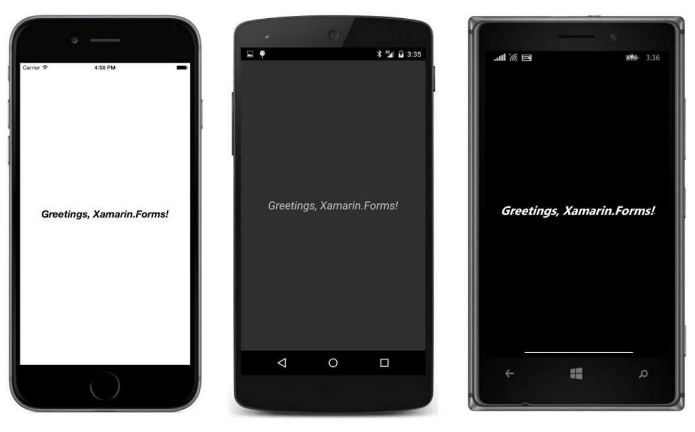

## Tamanho de Fontes e atributos {#tamanho-de-fontes-e-atributos}

O Label usa uma fonte padrão (ou do sistema) definida para cada plataforma, porém o Label também define varias propriedades que você pode usar para mudar esta fonte. Label é uma de apenas duas classes que tem propriedades relacionadas com fontes; Button é a outra.

As propriedades que permitem você alterar esta fonte são:

*   **FontFamily do tipo string**
*   **FontSize do tipo double**
*   **FontAttributes do tipo FontAttributes, uma enumeração com três membros: None, Blod e Italic.**

Há também uma propriedade Font correspondente a estrutura Font, mas esta está obsoleta e não deve ser usada.

A mais difícil destas propriedades para usar é FontFamily. Em teoria você pode ajustar com o nome da família de fonte tal como “Times Roman”, porem só irá funcionar se esta família de fonte em particular for suportada na plataforma. Por esta razão, você provavelmente vai usar FontFamily conectado com Device.OnPlatform, e você precisará conhecer os nomes das famílias de fonte suportadas em cada plataforma. Por isso, uma demonstração de FontFamily deve esperar um capitulo futuro.

A propriedade FontSize é um pouco estranha também. Você precisa de um número que indica aproximadamente a altura da fonte, mas quais números você deveria usar? Este é um assunto difícil, e por esta razão, é deixado para o Capítulo 5, &quot;Tratando de tamanhos,&quot; quando as ferramentas para escolher um bom tamanho de fonte estarão disponíveis. Até lá, entretanto, a classe Device ajuda com o método estático chamado GetNamedSize. Este método requer um membro da enumeração NamedSize:

*   **Default**
*   **Micro**
*   **Small**
*   **Medium**
*   **Large**

GetNamedSize também requer o tipo da classe que você está dimensionando com este tamanho de fonte, e o argumento será typeof(Label) ou typeof(Button). Você também pode usar uma instância do próprio Label ou Button em vez de Type, mas isto é frequentemente inconveniente.

Um aviso: specificar NamedSize.Medium não necessariamente retornará o mesmo tamanho como NamedSize.Default.

FontAttributes é a menos complicada das três propriedades relacionadas com fonte para usar. Você pode especificar Bold ou Italic ou ambas, como este pequeno trecho de código (adaptado do programa **Greetings** do capitulo anterior) demonstra:

Aqui está nas três plataformas:

