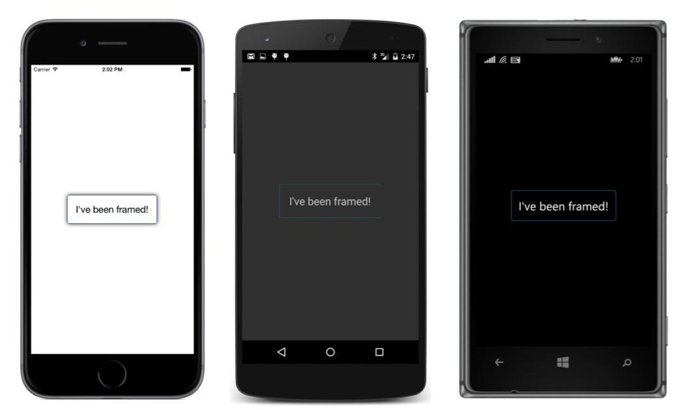
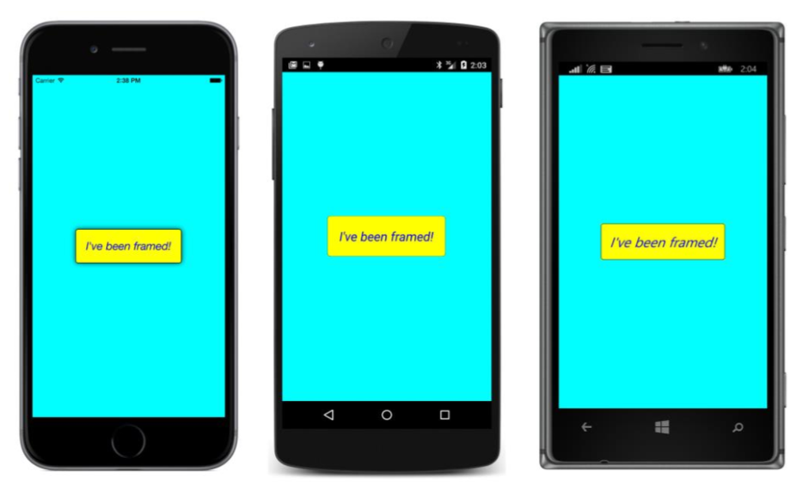
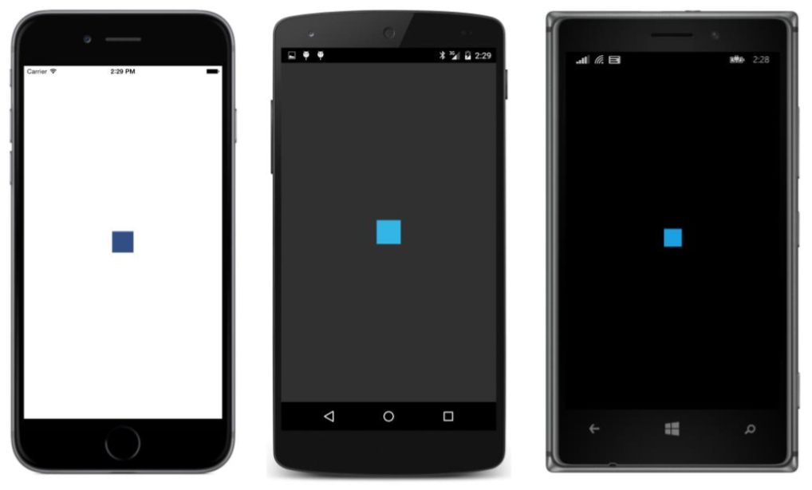
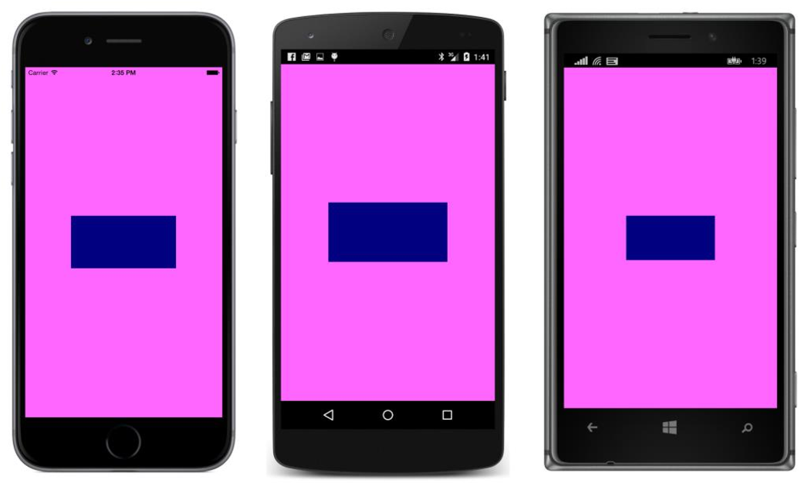
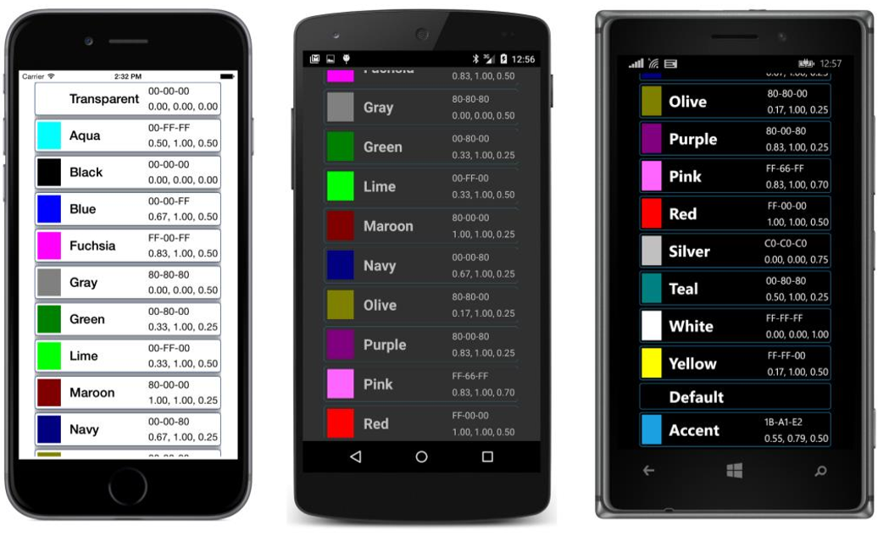

## Frame e BoxView {#frame-e-boxview}

Duas _views_ retangulares simples são muitas vezes úteis para fins de apresentação:

O _BoxView_ é um retângulo preenchido. Ele deriva de uma _View_ e define uma propriedade _Color_ que é transparente por padrão.

O _Frame_ apresenta uma borda retangular em torno de algum conteúdo. _Frame_ deriva de um _Layout_ em forma de _ContentView_, a partir da qual ela herda uma propriedade _Content_. O conteúdo de um _frame_ pode ser uma única _view_ ou um _layout_ que contém várias outras _views_. De um _VisualElement_, o _Frame_ herda uma propriedade _BackgroundColor_ que é branco no iPhone e transparente no Android e no Windows Phone.Do _Layout_, o _Frame_ herda uma propriedade _Padding_ que inicializa 20 unidades em todos os lados para darem ao conteúdo um espaço para respirar um pouco. O próprio _Frame_ define a si mesmo uma propriedade _OutlineColor_ que é transparente por padrão e uma propriedade _HasShadow_ que é _true_ por padrão, mas a sombra aparece apenas no iPhone.

Tanto o contorno do _Frame_ quanto o _BoxView_ são transparentes por padrão, então você pode ter um pouco de incerteza sobre como colori-los: Branco não vai aparecer contra o fundo padrão do iPhone, e preto não vai aparecer contra o fundo padrão do Android e do Windows Phone. Uma boa escolha é _Color.Accent_, que é garantida e mostra-se independente. Ou, você pode assumir o controle sobre a coloração do fundo, bem como o contorno da _Frame_ e da _BoxView_.

Se o _BoxView_ ou o _Frame_ não é limitado em tamanho, de qualquer maneira, isto é, se não é em um _StackLayout_ e tem suas _HorizontalOptions_ e _VerticalOptions_ definidas para os valores padrão de _LayoutOptions_._Fill_ essas _views_ expandem para preencher seus recipientes.

Por exemplo, aqui está um programa que tem uma _label_ centralizada definida para a propriedade _Content_ de um _Frame_:

O label está centralizado no _Frame_, mas o _Frame_ preenche toda a página, e você pode até não ser capaz de ver o _Frame_ claramente se a página não tiver dado um _Padding_ de 20 em todos os lados:

Para exibir o texto emoldurado centralizado, você terá de definir as propriedades _HorizontalOptions_ e _VerticalOptions_ do _Frame_ (em vez do _Label_) para _LayoutOptions_._Center_:

Agora, o _frame_ abraça o texto (mas com um _padding_ padrão de 20 unidades) no centro da página.

A versão do _FramedText_ incluída com o código de exemplo para este capítulo exerce a liberdade de dar uma cor personalizada a tudo:

O resultado parece praticamente o mesmo em todas as três plataformas.

Tente definir um _BoxView_ para a propriedade _Content_ de um _ContentPage_, assim:

Certifique-se de definir a propriedade de cores para que você possa vê-lo. O _BoxView_ preenche toda a área de seu contêiner, assim como uma _label_ faz com as configurações padrão de _HorizontalOptions_ ou de _VerticalOptions_:

É ainda subjacente a barra de status iOS!

Agora tente definir as propriedades _HorizontalOptions_ e _VerticalOptions_ do BoxView para algo diferente de _Fill_, como neste exemplo de código.

Neste caso, o _BoxView_ assumirá as suas dimensões padrão de 40 unidades quadradas:

O _BoxView_ é agora 40 unidades quadradas, porque o _BoxView_ inicializa suas propriedades _WidthRequest_ e _HeightRequest_ para 40\. Essas duas propriedades requerem uma pequena explicação:

A _VisualElement,_ define as propriedades de _Width_ e _Height_, mas estas propriedades são somente leitura. A _VisualElement_ também define as propriedades _WidthRequest_ e _HeightRequest_ que são objetos do tipo _get_ e _set_. Normalmente, todas estas propriedades são inicializadas com valor -1 (que na prática significa que eles são indefinidos), mas algumas derivadas de _views_, tais como _BoxView_, definem as propriedades _WidthRequest_ e _HeightRequest_ para valores específicos.

Seguindo o layout de uma página, as propriedades _Width_ e _Height_ indicam dimensões atuais da _view_ – a área que a _view_ ocupa na tela. Pelo fato de _Width_ e _Height_ serem do tipo somente leitura, eles são apenas para fins informativos. (Capítulo 5, &quot;Lidar com tamanhos&quot;, descreve como trabalhar com esses valores.)

Se você quiser uma _view_ de tamanho específico, você pode definir as propriedades _WidthRequest_ e _HeightRequest_. Mas essas propriedades indicam (como seus nomes sugerem) um tamanho solicitado ou um tamanho preferido. Se a _view_ for definida para preencher o recipiente, essas propriedades serão ignoradas.

O _BoxView_ define suas próprias propriedades _WidthRequest_ e _HeightRequest_ para 40\. Você pode pensar nessas configurações como um tamanho que BoxView gostaria de ser, se ninguém tivesse qualquer opinião que importasse. Você já viu que _WidthRequest_ e _HeightRequest_ são ignoradas quando o _BoxView_ é definido para preencher a página. O _WidthRequest_ entra em ação se o _HorizontalOptions_ estiver definido para _LayoutOptions_._Left_, _Center_ ou _Right_, ou se o _BoxView_ for filho de um _StackLayout_ horizontal. O _HeightRequest_ se comporta de forma semelhante.

Aqui está a versão do programa em que há um _SizedBoxView_ incluído com o código para este capítulo:

Agora temos um _BoxView_ com seu tamanho específico e as cores definidas explicitamente:

Vamos usar tanto o _frame_ como o _BoxView_ em uma lista de cores melhorada. O programa _ColorBlocks_ tem um construtor de página que é praticamente idêntico ao de _ReflectedColors_, exceto que ele chama um método nomeado _CreateColorView_ ao invés de _CreateColorLabel_. Aqui está este método:

O método _CreateColorView_ retorna um _frame_ contendo um _StackLayout_ horizontal com uma _BoxView_ indicando a cor, uma _label_ para o nome da cor, e outro _StackLayout_ com mais duas _label_ _views_ para a composição de RGB e valores de _Hue_, _Saturation_ e _Luminosity_. Os monitores RGB e HSL são sem sentido para o valor de _Color_._Default_, de modo que _StackLayout_ tem sua propriedade _IsVisible_ definido como _false_ nesse caso. O _StackLayout_ ainda existe, mas é ignorado quando a página é processada.

O programa não sabe qual elemento vai determinar a altura de cada item de cor - o _BoxView_, a label com o nome da cor, ou as duas _label_ _view_s com valores RGB e HSL - assim ele centraliza todas as _label views_. Como você pode ver, o _BoxView_ expande em altura para acomodar a altura do texto:

Agora, esta é uma lista de cores com rolagem que está começando a ser algo que pode nos dar um pouco de orgulho.