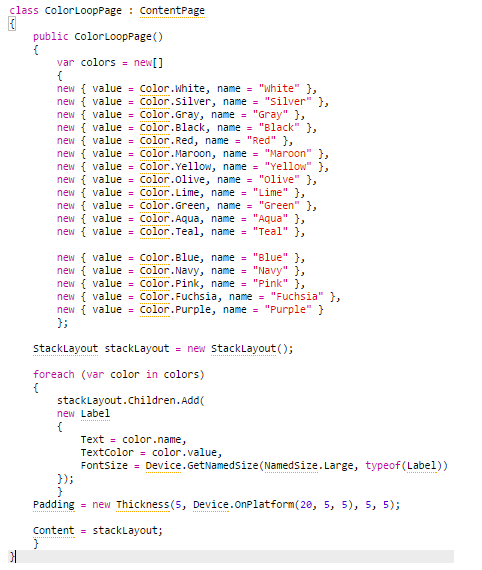
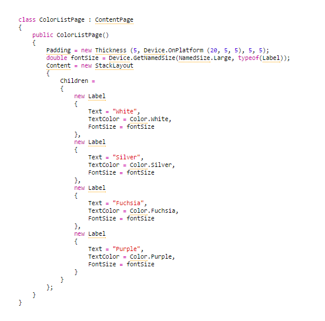
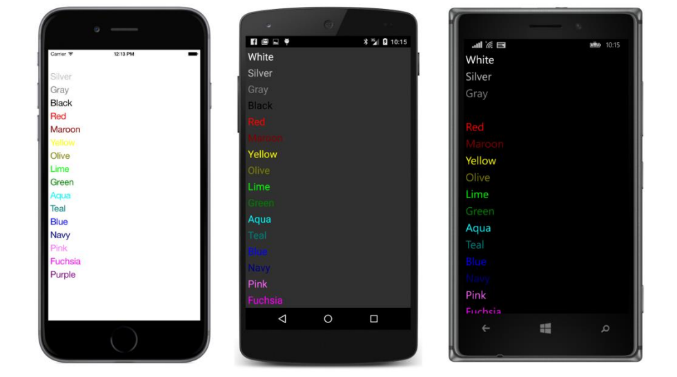
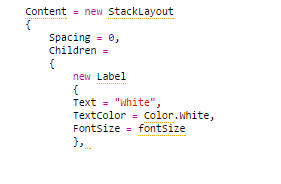

## Pilhas de views {#pilhas-de-views}

A classe StackLayout organiza seus filhos em uma pilha. Ela define apenas duas propriedades próprias:

*   **_Orientation_ do tipo _StackOrientation_, uma enumeração com dois membros: _Vertical_ (o padrão) e _Horizontal_.**
*   **_Spacing_ do tipo _double_, inicializando em 6.**

StackLayout parece ideal para o trabalho de listagem de cores. Você pode usar o método _Add_ definido por _IList&lt;T&gt;_ para adicionar um herdeiro à coleção _Children_ da instância _StackLayout_. Aqui está um código que cria vários objetos de _Label_ a partir de duas matrizes e, em seguida, adiciona cada _Label_ para a coleção _Children_ de um _StackLayout_:

O objeto _StackLayout_ pode então ser definido como a propriedade _Content_ da página.

Mas a técnica de usar matrizes paralelas é bastante perigosa. E se elas estiverem fora de sincronia ou tiverem um número diferente de elementos? Uma abordagem melhor é manter a cor e o nome juntos, talvez em uma pequena estrutura com campos de _Color_ e _Name_, ou como uma matriz de valores _Tuple &lt;Color, string&gt;_, ou como um tipo anônimo, como demonstrado no programa **_ColorLoop_**:

Ou você pode inicializar a propriedade _Children_ de _StackLayout_ com a coleção explicita de _views_ (semelhante ao modo da coleção _Spans_ do objeto _FormattedString_ que foi inicializado no capítulo anterior). O programa **ColorList** define a propriedade _Content_ da página para um objeto _StackLayout_ que então tem sua propriedade _Children_ inicializada com 17 _Label views_:

Você não precisa ver o código de todos os 17 filhos para ter uma ideia! Independentemente de como você preencha a coleção _Children_, aqui está o resultado:

Obviamente, isto não é ótimo. Algumas cores não são visíveis a todos, e algumas delas são muito fracas para ler bem. Além disso, a lista transborda a página em duas plataformas, e não há nenhuma maneira de deslocá-lo para cima.

Uma solução consiste em reduzir o tamanho do texto. Em vez de usar _NamedSize.Large_, tente um dos valores menores.

Outra solução é no próprio _StackLayout_: _StackLayout_ que define uma propriedade _Spacing_ do tipo _double_ que indica o quanto de espaço deixar entre os herdeiros. Por padrão, e 6.0, mas você pode definir um valor menor (por exemplo, zero) para garantir que todos os itens se encaixem:

Agora todas as visualizações Label ocupam apenas o espaço vertical como requerido para o texto. Você pode até mesmo definir _Spacing_ para valores negativos para fazer os itens se sobreporem.

Rolagem não é automática e deve ser adicionada com um _ScrollView_. Mas há outro problema com esses programas: eles precisam criar explicitamente uma ordem de cores e nomes ou criar explicitamente uma _Label view_ para cada cor. Isso é um pouco tedioso, e, portanto, repulsivo para programadores. Poderia ser automatizado?