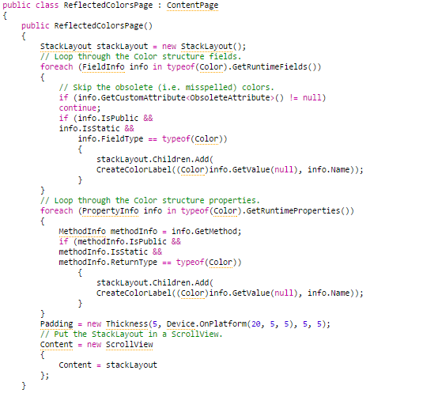
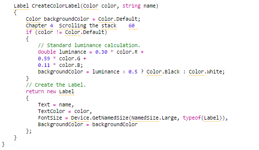
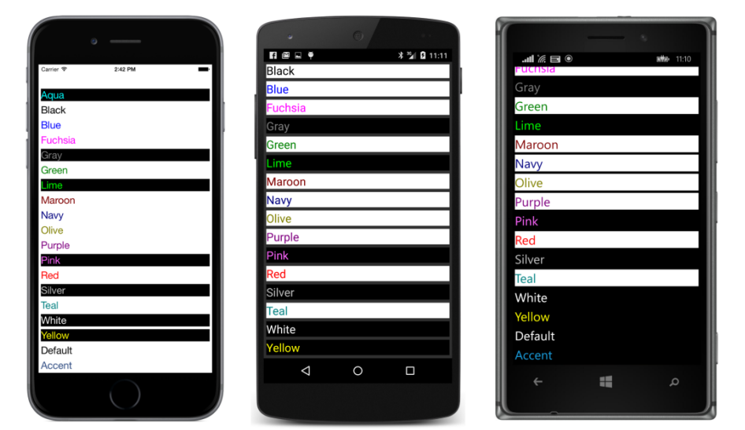

## Rolando conteúdo {#rolando-conte-do}

Tenha em mente que um programa Xamarin.Forms tem acesso às bibliotecas de classe básica .NET e pode usar a reflexão .NET para obter informações sobre todas as classes e estruturas definidas em uma montagem, tais como Xamarin.Forms.Core. Isto sugere que a obtenção dos campos estáticos e propriedades da estrutura de cores pode ser automatizado.

A maioria das reflexões .NETcomeça com um objeto _Type_. Você pode obter um objeto _Type_ para qualquer classe ou estrutura usando o operador _typeof_ em C#. Por exemplo, a expressão _typeof_ (_Color_) retorna um objeto _Type_ para a estrutura _Color_.

Na versão .NET disponível no PCL, um método de extensão para a classe _Type_, denominado _GetTypeInfo_, retorna um objeto _TypeInfo_ a partir do qual as informações adicionais podem ser obtidas. Mas que não é necessário neste programa. Em vez disso, outros métodos de extensão são definidos para a classe _Type_, nomeados _GetRuntimeFields_ e _GetRuntimeProperties_, que retornam os campos e propriedades do tipo. Estes são na forma de coleções dos objetos _FieldInfo_ e _PropertyInfo_. Destes, os nomes, bem como os valores das propriedades podem ser obtidas.

Isso é demonstrado pelo programa **ReflectedColors.** O arquivo _ReflectedColorsPage.cs_ requer o _using_ para _System.Reflection._

Em duas declarações _foreach_ separadas, a classe _ReflectedColorsPage_ percorre todos os campos e as propriedades da estrutura _Color_. Para todos os membros estáticos públicos que retornam valores de _Color_, os dois _loops_ chamam o método _CreateColorLabel_ para criar uma _Label_ com o valor da cor e nome e em seguida, adiciona ao _StackLayout_.

Ao incluir todos os campos estáticos públicos e propriedades, o programa lista _Color.Transparent_, _Color.Default_, e _Color.Accent_ juntamente com os 17 campos estáticos exibidos no programa anterior.

Perto do fim do construtor, o _StackLayout_ está definido para a propriedade _Content_ do

_ScrollView_, o qual é então ajustado para a propriedade _Content_ da página.

Ao usar o código para adicionar os herdeiros a um _StackLayout_, é geralmente uma boa idéia que o StackLayout esteja desconectado da página que eventualmente irá exibi-lo. Cada novo filho adicionado ao _StackLayout_ faz com que o tamanho da StackLayout mude, e se o _StackLayout_ estiver ligado a página, muito do _layout_ vai para algo que não é realmente necessário.

O método _CreateColorLabel_ na classe tenta fazer com que cada cor seja visível, definindo um fundo contrastante. O método calcula um valor de luminância com base na média ponderada normal dos componentes vermelho, verde e azul e, em seguida, seleciona um fundo branco ou preto.

Esta técnica não vai funcionar para _Transparent_, de modo que o item não pode ser exibido em tudo, e o método trata _Color.Default_ como um caso especial e mostra que a cor (seja ela qual for) contra um fundo _Color.Default_.

Aqui estão os resultados, que ainda estão muito longe de ser esteticamente satisfatórios:

Mas você pode rolar a tela porque o _StackLayout_ é herdeiro de um _ScrollView_. Você deve se lembrar que a classe _Layout&lt;T&gt;_ define a propriedade Children que _StackLayout_ herda. A classe genérica _Layout&lt;T&gt;_ é derivada da classe não genérica _Layout_, e _ScrollView_ também deriva da classe não genérica _Layout._ Teoricamente, _ScrollView_ é um tipo de objeto _Layout_ – mesmo que tenha apenas um filho.

Como você pode ver na captura de tela, a cor de fundo da _Label_ extende-se a toda a largura do _StackLayout_, o que significa que cada _Label_ é tao larga quanto o _StackLayout_.

Vamos experimentar um pouco para obter uma melhor compreensão da disposição do Xamarin.Forms. Para estas experiências, você pode querer temporariamente dar a _StackLayout_ e o _ScrollView_ cores de fundo distintas.

Objetos de layout usualmente tem fundo transparente por padrão. Embora ocupem uma area sobre a tela, não são visiveis diretamente. Dar cores temporarias a objetos de layout é uma ótima maneira de ver exatamente onde eles estão na tela. É uma boa técnica de depuração para layouts complexos.

Você vai descobrir que um _StackLayout_ azul aparece para fora no espaço entre a _Label_ _view_ individual – este é um resultado padrão da propriedade _Spacing_ do _StackLayout_ – e também através da _Label_ para _Color.Default_, que tem um fundo transparente.

Tente definir a propriedade _HorizontalOptions_ de todas as _Label view_ para _LayoutOptions.Start_:

Agora, o fundo azul do _StackLayout_ é ainda mais proeminente porque todas as _Label views_ ocupam apenas a quantidade de espaço horizontal que o texto requer, e todos eles são empurrados para o lado esquerdo. Porque cada _Label view_ _tem_ uma largura diferente, esta visualização parece ainda mais feia do que a primeira versão.

Agora remova as definições de _HorizontalOptions_ na _Label_, e em vez disso defina um _HorizontalOptions_ no _StackLayout_:

Agora, o _StackLayout_ se tornou tão larga quanto a _Label_ mais larga. O _StackLayout_ abraça as _labels_ dentro do _ScrollView_ – a esquerda no iPhone e Android, e no centro (curiosamente) no Windows Phone – com fundo vermelho do _ScrollView_ agora visualizado claramente.

Quando você começa a construir uma árvore de objetos visuais, esses objetos adquirem uma relação de pai-filho. Um objeto pai é muitas vezes referido como o recipiente do seu filho ou filhos porque a localização e tamanho da criança está contida dentro de seu pai.

Por padrão, _HorizontalOptions_ e _VerticalOptions_ são definidos como _LayoutOptions.Fill_, que significa que os tipos de visualização filho tentam preencher o recipiente pai. (Pelo menos com os recipientes encontrados até agora. Como você verá, as outras classes de _layout_ têm um comportamento um pouco diferente.) Mesmo uma _Label_ preenche seu recipiente pai por padrão, embora sem uma cor de fundo, a _Label_ parece ocupar apenas a quantidade de espaço que requer.

Definindo uma propriedade _view_ _HorizontalOptions_ ou _VerticalOptions_ para _LayoutOptions.Start_, _Center_ ou _End_ efetivamente força a visualização a encolher – horizontal, vertical ou ambos – para um único tamanho que a visualização requer.

Um _StackLayout_ tem este mesmo efeito em tamanho vertical de seu filho: cada filho em um _StackLayout_ ocupa apenas a altura que exige. Definindo a propriedade _VerticalOptions_ no filho de um _StackLayout_ para _Start_, _Center_, ou _End_ não tem efeito! No entanto, uma _view_ filho ainda se expande para preencher a largura do _StackLayout_, exceto quando o filho recebe uma propriedade _HorizontalOptions_ diferente de _LayoutOptions.Fill_.

Se um _StackLayout_ está definido para a propriedade _Content_ de um _ContentPage_, você pode definir _HorizontalOptions_ ou _VerticalOptions_ no _StackLayout_. Essa propriedade tem dois efeitos: primeiro, eles encolhem a largura ou altura (ou ambos) do _StackLayout_ para o tamanho dos seus filhos, e segundo, eles governam onde o _StackLayout_ está posicionado em relação à página.

Se um _StackLayout_ está numa _ScrollView_, o _ScrollView_ faz com que o _StackLayout_ seja apenas tão alto quanto a soma das alturas dos seus filhos. Isto é como o _ScrollView_ pode determinar como rolar verticalmente um _StackLayout_. Você pode continuar a definir _HorizontalOptions_ no _StackLayout_ para controlar a largura e a colocação horizontal.

No entanto, o que você não quer fazer é definir _VerticalOptions_ no _ScrollView_ para _LayoutOptions_._Start_, _Center_ ou _End_. O _ScrollView_ deve ser capaz de deslocar o seu conteúdo filho, e a única maneira de fazer isso é forçando seu filho (geralmente um _StackLayout_) a assumir uma altura que reflete apenas o que o filho precisa e, em seguida, usar a altura deste filho e sua própria altura para calcular o quanto rolar esse conteúdo.

Se você define _VerticalOptions_ no _ScrollView_ para _LayoutOptions_._Start_, _Center_ ou _End_, você está efetivamente dizendo ao _ScrollView_ para ser tão alto quanto precisa ser. Mas o que é isso? Porque _ScrollView_ pode rolar o seu conteúdo, ele não precisa ter qualquer altura particular, então ele vai encolher para nada.

Embora colocar um _StackLayout_ em um _ScrollView_ é normal, colocar um _ScrollView_ em um _StackLayout_ é perigoso. O _StackLayout_ forçará o _ScrollView_ ter uma altura de apenas o que requer, e que a altura necessária é praticamente zero.

No entanto, existe um modo para colocar um _ScrollView_ num _StackLayout_ com sucesso, e que será demonstrada em breve.

A discussão anterior aplica-se a um _StackLayout_ orientado verticalmente e _ScrollView_. _StackLayout_ possui uma propriedade chamada _Orientation_ que você pode definir para um membro de _StackOrientation_ - Vertical (o padrão) ou horizontal. Da mesma forma, ScrollView tem uma propriedade _ScrollOrientation_ que você define para um membro de _ScrollOrientation_. Tente esta:

Agora os _Labels_ _views_ são empilhados horizontalmente, e o _ScrollView_ preenche a página na vertical, mas permite deslizamento horizontal do _StackLayout_, que verticalmente preenche o _ScrollView_.

Parece muito estranho com as opções de layout verticais padrão, mas aqueles poderiam ser fixados para torná-la um pouco melhor.