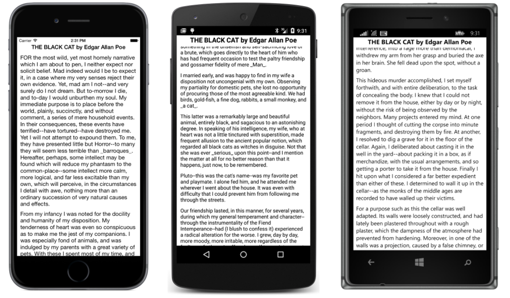

## Um ScrollView numa StackLayout? {#um-scrollview-numa-stacklayout}

É comum colocar um _StackLayout_ em um _ScrollView_, mas você pode colocar um _ScrollView_ em um _StackLayout_? E por que você quer mesmo?

É uma regra geral em sistemas de layout como o do _Xamarin_._Forms_ que você não pode colocar uma rolagem de página em uma pilha. Um _ScrollView_ precisa ter uma altura específica para calcular a diferença entre a altura do seu conteúdo e a sua própria altura. Essa diferença é o montante que o _ScrollView_ pode rolar seus conteúdos. Se o _ScrollView_ está em uma _StackLayout_, ele não recebe essa altura específica. O _StackLayout_ quer que o _ScrollView_ seja o mais curto possível, e isso é a altura do conteúdo do ScrollView ou zero, e nenhuma solução funciona.

Então, por que você quer um _ScrollView_ em um _StackLayout_ de qualquer maneira?

Às vezes é exatamente o que você precisa. Considere um leitor de e-book primitivo que implementa rolagem. Você pode querer uma _label_ na parte superior da página exibindo sempre o título do livro, seguido por um _ScrollView_ contendo uma _StackLayout_ com o conteúdo do livro em si. Seria conveniente para esse _label_ e para o _ScrollView_ serem filhos de um _StackLayout_ que preenche a página.

Com _Xamarin_._Forms_, tal coisa é possível. Se você der a _ScrollView_ um _VerticalOptions_ definindo _LayoutOptions_._FillAndExpand_, ele pode realmente ser um filho de um _StackLayout_. O _StackLayout_ vai dar ao _ScrollView_ todo o espaço extra não exigida pelos outros filhos, e a _ScrollView_ terá, então, uma altura específica.

O projeto BlackCat exibe o texto de conto de Edgar Allan Poe &quot;The Black Cat&quot;, que é armazenado em um arquivo de texto chamado TheBlackCat.txt em um formato de uma linha-por-parágrafo.

Como o programa BlackCat acessa o arquivo com este conto? Às vezes é conveniente incorporar arquivos que um aplicativo requer autorização no executável do programa ou - em caso de uma aplicação _Xamarin_._Forms -_ autorização direto na biblioteca DLL de Classes Portátil. Esses arquivos são conhecidos como recursos incorporados, e é isso que o arquivo TheBlackCat.txt é neste programa.

Para fazer um recurso incorporado no Visual Studio ou no Xamarin Studio, você provavelmente vai querer primeiro criar uma pasta no projeto, selecionando a opção **Add &gt; New Folder** no menu projeto. A pasta para os arquivos de texto pode ser chamada de **Textos**, por exemplo. A pasta é opcional, mas ajuda a organizar ativos do programa. Então, para essa pasta, você pode selecionar o **Add&gt; Existing Item** no Visual Studio ou **Add &gt; Add Files** no Xamarin Studio. Navegue até o arquivo, selecione-o e clique em **Add** no Visual Studio ou **Open** em Xamarin Studio.

Agora aqui é a parte mais importante: Uma vez que o arquivo é parte do projeto, abra o diálogo a partir do menu associado com o arquivo e vá em **Propriedades**. Especifique que a **Build Action** para o arquivo é **_EmbeddedResource_**. Este é um passo fácil de esquecer, mas é essencial.

Isso foi feito para o projeto BlackCat, e, consequentemente, o arquivo TheBlackCat.txt fica embutido no arquivo BlackCat.dll.

No código, o arquivo pode ser recuperado chamando o método _GetManifestResourceStream_ definido pela classe _Assembly_ no _namespace_ _System_._Reflection_. Para chegar a _assembly_ do PCL, tudo que você precisa fazer é obter o tipo de qualquer classe definida na _assembly_. Você pode usar _typeof_ com o tipo de página derivada da _ContentPage_ ou GetType na instância dessa classe. Em seguida, deve-se chamar _GetTypeInfo_ neste objeto _Type_. _Assembly_ é uma propriedade resultante do objeto _TypeInfo_:

No método _GetManifestResourceStream_ da _Assembly_, você precisa especificar o nome do recurso. Para recursos incorporados, esse nome não é o _filename_ do recurso, mas a _resource ID_. É fácil confundir estes porque que ID pode parecer vagamente como um nome de arquivo totalmente qualificado.

O _resource ID_ começa com o _namespace_ padrão do _assembly_. Este não é o _namespace_ .NET! Para obter o _namespace_ padrão do _assembly_ no Visual Studio, selecione Properties do projeto no menu, e na caixa de diálogo Propriedades, selecione _Library_ no lado esquerdo e veja o campo _Default_ _Namespace_. Em Xamarin Studio, selecione _Options_ no menu projeto e na caixa de diálogo _Project_ _Options_, selecione _Main_ _Settings_ à esquerda, e veja um campo denominado _Default_ _Namespace_.

Para o projeto **BlackCat**, o _namespace_ padrão é o mesmo que o _assembly_: &quot;BlackCat&quot;. No entanto, você pode redefinir o _namespace_ padrão para o nome que quiser.

O _resource ID_ começa com que há no _namespace_ padrão, seguido por um período, seguido pelo nome da pasta que você pode ter usado, seguido por outro período e o nome do arquivo. Para este exemplo, o _resource ID_ é &quot;BlackCat.Texts.TheBlackCat.txt&quot; - e isso é o que você verá passando para o método _GetManifestResourceStream_ no código. O método retorna um objeto .NET _Stream_, e a partir desse, um _StreamReader_ pode ser criado para ler as linhas de texto.

É uma boa idéia usar declarações _using_ com o objeto _Stream_ retornado de _GetManifestResourceStream_ e o objeto _StreamReader_, porque isso irá descartar corretamente os objetos quando eles não forem mais necessários ou se causarem exceções.

Para fins de layout, o construtor _BlackCatPage_ cria dois objetos _StackLayout_: _mainStack_ e _textStack_. A primeira linha do arquivo (contendo título e autor da história) se torna um _label_ em _mainStack_ em negrito e centralizado; todas as linhas subsequentes ficarão em _textStack_. A instância _mainStack_ também contém um _ScrollView_ com _textStack_.

Observe que o _ScrollView_ tem sua propriedade _VerticalOptions_ definida para _LayoutOptions_._FillAndExpand_. Sem isso, este programa não vai funcionar. Com ele, o texto é rolável enquanto o título permanece no lugar.

Pelo fato deste ser basicamente um leitor de e-book, e os seres humanos leem o texto preto em papel branco por centenas de anos, o _BackgroundColor_ da página é definido como branco e o _TextColor_ de cada _label_ está definido para preto:

BlackCat é uma aplicação PCL. Também é possível escrever este programa usando um projeto de ativos compartilhados em vez de um PCL, e incluído com o código para este capítulo está BlackCatSap. No entanto, se você colocar um recurso incorporado em um SAP, o nome da pasta não é parte do _resource ID_. Ele será basicamente ignorado. Além disso, pelo fato do recurso tornar-se realmente parte do projeto de aplicativo, você irá precisar do _namespace_ padrão para a aplicação, e isso é diferente para cada plataforma. O código para definir a variável de recurso parece com esse:

Se você estiver tendo problemas fazendo referência a um recurso incorporado, você pode estar usando um nome incorreto. Tente chamar _GetManifestResourceNames_ no objeto _Assembly_ para obter uma lista dos _resource IDs_ de todos os recursos incorporados.